# Руководство 1. Обычный режим работы

> **Обычный режим** — основной способ работы с PLC AI Studio. Вы загружаете перечень сигналов (IOLIST) и техническое задание, выбираете тип установки и получаете готовую программу ПЛК на языке Structured Text вместе со схемами и описанием.
>
> Это руководство ведёт вас шаг за шагом — от запуска до экспорта готового кода в контроллер.

---

## Содержание

1. [Когда использовать обычный режим](#1-когда-использовать-обычный-режим)
2. [Что подготовить заранее](#2-что-подготовить-заранее)
3. [Полная последовательность действий](#3-полная-последовательность-действий)
4. [Шаг 1. Запуск и главный экран](#шаг-1-запуск-и-главный-экран)
5. [Шаг 2. Выбор типа установки (категории)](#шаг-2-выбор-типа-установки-категории)
6. [Шаг 3. Загрузка IOLIST](#шаг-3-загрузка-iolist)
7. [Шаг 4. Загрузка технического задания](#шаг-4-загрузка-технического-задания)
8. [Шаг 5. Настройка ИИ-провайдера](#шаг-5-настройка-ии-провайдера)
9. [Шаг 6. Запуск генерации](#шаг-6-запуск-генерации)
10. [Шаг 7. Просмотр и выбор результата](#шаг-7-просмотр-и-выбор-результата)
11. [Шаг 8. Проверка и исправление кода](#шаг-8-проверка-и-исправление-кода)
12. [Шаг 9. Схемы и описание](#шаг-9-схемы-и-описание)
13. [Шаг 10. Экспорт в контроллер](#шаг-10-экспорт-в-контроллер)
14. [Частые вопросы](#частые-вопросы)

---

## 1. Когда использовать обычный режим

Обычный режим подходит, когда у вас есть **одна установка или система** с понятным перечнем сигналов: вентустановка, конвейерная линия, насосная станция, котёл и т. п. Вы подаёте программе один IOLIST и одно ТЗ — на выходе получаете цельную программу для этого объекта.

Если объектов несколько и они связаны между собой (например, котельная + водоподготовка + пожарная сигнализация) — это уже [Блок-проект](Руководство_3_Блок_проект.md). Если нужен один аккуратно оформленный типовой объект — посмотрите [Блок-объект](Руководство_2_Блок_объект.md).

---

## 2. Что подготовить заранее

Перед началом работы соберите два файла:

- **IOLIST** — перечень сигналов в виде таблицы (`.xlsx`, `.xls`, `.csv`, `.tsv`) или `.json`. В нём должны быть как минимум: имя сигнала, тип (дискретный/аналоговый, вход/выход) и описание.
- **Техническое задание (ТЗ)** — текстовый документ (`.pdf`, `.docx`, `.txt`), описывающий, как должна работать установка: режимы, уставки, блокировки, аварии.

  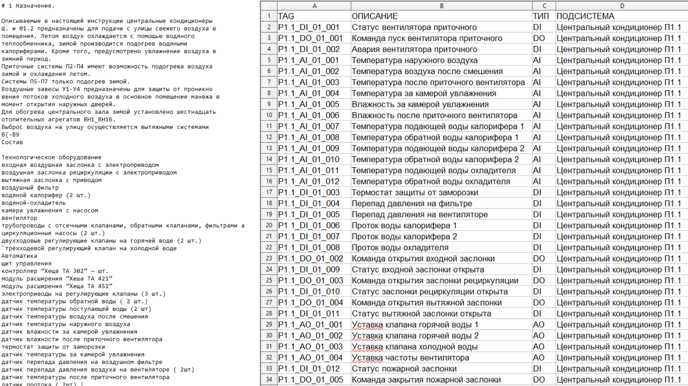

> 📷 Фото: пример заполненной таблицы IOLIST и документа ТЗ рядом, чтобы пользователь понимал, как выглядят исходные данные.

ТЗ не обязательно, но с ним результат точнее: программа извлекает из текста уставки и алгоритм. Без ТЗ доступен упрощённый режим генерации только по сигналам.

---

## 3. Полная последовательность действий

Ниже — карта всего процесса. Каждый блок подробно расписан в следующих разделах.

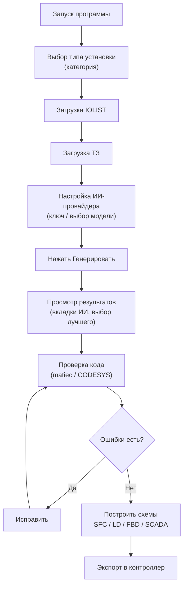

*Схема 1. Полный маршрут пользователя в обычном режиме.*

---

## Шаг 1. Запуск и главный экран

После запуска программы открывается рабочее окно. Слева — панель проекта (выбор категории и загрузка файлов), в центре — редактор кода, справа — кнопки действий и кнопка **Генерировать**.

> 📷 Фото: общий вид главного окна с подписанными зонами: слева панель загрузки, в центре редактор, справа кнопка «Генерировать».

В нижней части центрального окна находится журнал — там отображается прогресс генерации и сообщения программы.

---

## Шаг 2. Выбор типа установки (категории)

В левой панели вверху находится выпадающий список **категорий (сценарий)**. Это тип вашей установки — он подбирает правильные эталоны и формулировки для генерации.

Доступные категории (сценарии): вентиляция/BMS, конвейерные линии, водоподготовка, энергетика, HMI/SCADA, безопасность, управление движением, котельные, пожарная сигнализация.

> 📷 Фото: раскрытый выпадающий список категорий в левой панели.

Выберите ту, что ближе всего к вашему объекту. От этого зависит, какие проверенные образцы программа покажет нейросети как пример.

---

## Шаг 3. Загрузка IOLIST

Под выбором категории расположена кнопка **«Загрузить IOLIST»**. Нажмите её и выберите вашу таблицу сигналов.

> 📷 Фото: кнопка «Загрузить IOLIST» и окно выбора файла; после загрузки имя файла отображается рядом с кнопкой.

Программа автоматически находит строку заголовков и распознаёт колонки. После успешной загрузки название файла появится на кнопке, а в журнале — число распознанных сигналов.

> ⚠️ **Проверьте число сигналов в журнале.** Если оно сильно отличается от ожидаемого — вероятно, в таблице нестандартные заголовки. Откройте таблицу и убедитесь, что есть колонки с именем, типом и направлением сигнала.

---

## Шаг 4. Загрузка технического задания

Рядом находится кнопка **«Загрузить ТЗ»**. Нажмите и выберите документ с описанием алгоритма работы.

> 📷 Фото: кнопка «Загрузить ТЗ» с выбранным PDF/DOCX-файлом.

Программа извлечёт из текста числовые уставки (температуры, давления, выдержки времени) и логику работы. Эти данные попадут в генерацию вместе с сигналами.

---

## Шаг 5. Настройка ИИ-провайдера

Откройте **Настройки ИИ-генерации** (кнопка с иконкой робота на правой панели активности).

> 📷 Фото: окно настроек ИИ: выбор провайдера, поле API-ключа, поле модели.

Здесь нужно:

1. Выбрать провайдера (DeepSeek бесплатная версия).
2. Ввести **API-ключ** этого провайдера (хранится локально у вас).
3. При желании — указать конкретную модель и температуру.

Для параллельного сравнения нескольких ИИ можно ввести ключи сразу для нескольких провайдеров — тогда они отработают одновременно, и вы выберете лучший результат.

> 💡 Если у вас активен пробный период — доступны все провайдеры. После его окончания на бесплатном тарифе останутся DeepSeek и Ollama; Anthropic/OpenAI/Gemini будут доступны по подписке.

Выбрать Агентов — это не одна нейросеть, а **связка шагов**, дающая более высокое качество ценой большего времени.

| Агент           | Как работает                                                                                                                                                                | В чём ценность                                                           |
| -------------------- | -------------------------------------------------------------------------------------------------------------------------------------------------------------------------------------- | ------------------------------------------------------------------------------------ |
| **R2-PLCGen**  | Планирует архитектуру → генерирует → проверяет компилятором → исправляет по найденным замечаниям. | Целостный план и самопроверка всей программы. |
| **Agents4PLC** | Подбирает похожие проверенные образцы → генерирует по ним → проверяет условия корректности.             | Опора на эталоны и проверка постусловий.           |
| **truST**      | Генерирует в строгом стиле (единый стандарт оформления, обработка фронтов, явный сброс выходов).       | Строгая, единообр                                                     |

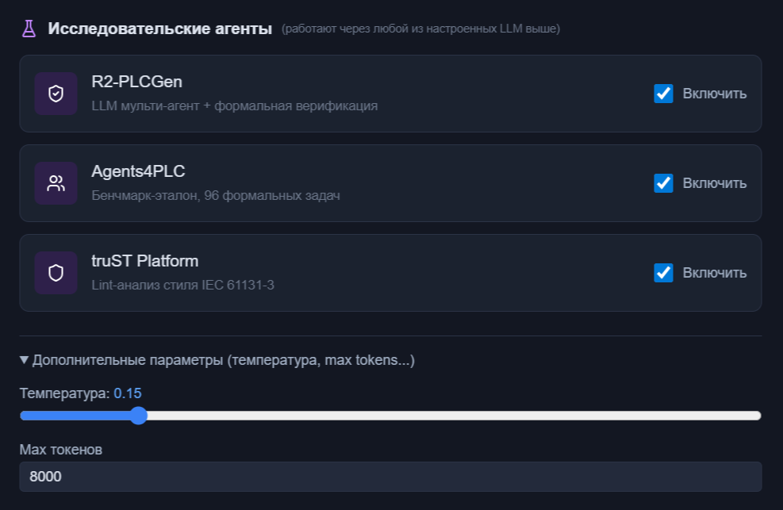

---

## Шаг 6. Пользовательские библиотеки

У каждого инженера и предприятия есть свои наработанные функциональные блоки: проверенный PID, фирменная логика управления насосом, блок аварийной сигнализации по внутренним стандартам. При обычной генерации ИИ изобретает их заново — каждый раз немного иначе.

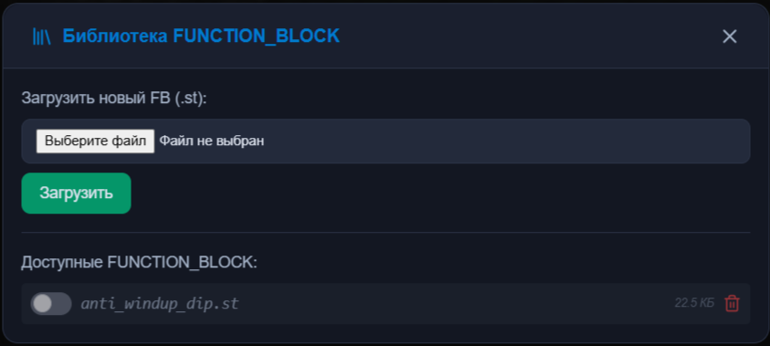

**Пользовательские библиотеки решают это.** Загрузите свой `.st`-файл с готовыми FUNCTION_BLOCK — система прочитает интерфейсы ваших блоков (входы, выходы, типы) и при генерации будет вызывать именно их, а не изобретать аналоги. Код становится единообразным со всеми проектами организации.

Каждый блок можно временно отключить тумблером, не удаляя файл — удобно для экспериментов и переключения между версиями библиотеки. Состояние сохраняется между запусками.

---

## Шаг 7. Запуск генерации

Когда IOLIST и ТЗ загружены, а провайдер настроен — нажмите **Генерировать** (большая кнопка справа).

> 📷 Фото: кнопка «Генерировать код» и рядом «Строгая генерация», с подсказкой при наведении.

Рядом есть кнопка **«Надёжный режим»** — она работает медленнее, но генерирует и чинит код поблочно с проверкой компилятором. Используйте её для ответственных или больших проектов.

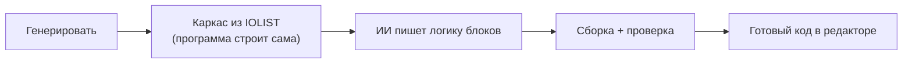

*Схема 2. Что происходит после нажатия «Генерировать».*

В журнале внизу видно прогресс: разбор сигналов, построение каркаса, генерация логики, проверка. Дождитесь сообщения о завершении.

---

## Шаг 8. Просмотр и выбор результата

Готовый код появляется в центральном редакторе. Если работали несколько ИИ — сверху появятся **вкладки** по одному на каждого провайдера, а лучший вариант отмечен значком.

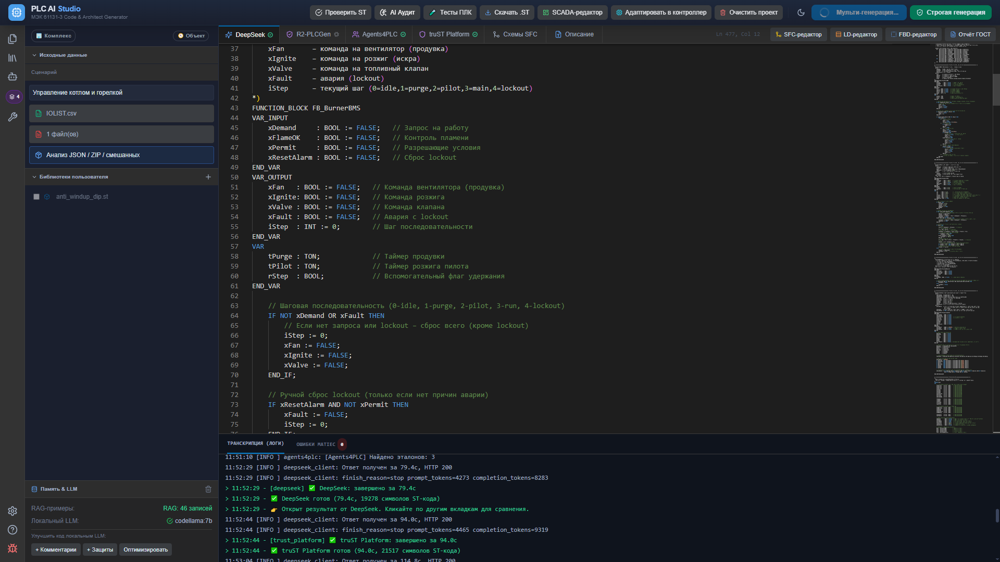

> 📷 Фото: редактор с готовым ST-кодом и вкладками результатов разных ИИ, лучший помечен значком.

Программа оценивает каждый вариант автоматически (компилируется ли, насколько полно покрыты сигналы, насколько модульный код). Вы можете переключаться между вкладками и сравнивать.

---

## Шаг 9. Проверка и исправление кода

Над редактором есть кнопка проверки кода. Выберите цель — **matiec** (строгий стандарт, максимальная переносимость) или **CODESYS** (с удобными расширениями) — и запустите проверку.

> 📷 Фото: выбор цели проверки и результат: «0 ошибок» либо список замечаний компилятора.

Если есть ошибки — нажмите кнопку исправления: программа приведёт код под выбранную цель и устранит замечания. При необходимости повторите проверку.

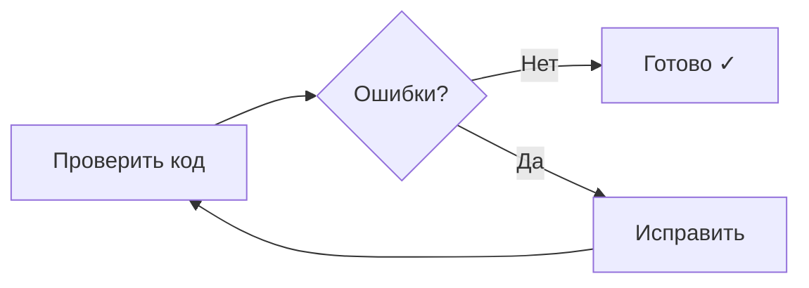

*Схема 3. Цикл проверки и исправления.*

---

## Шаг 10. AI-Аудит и цикл исправления

После генерации и проверки компилятором инженер может запустить  **AI-Аудит** : один ИИ рецензирует код, сгенерированный другим.

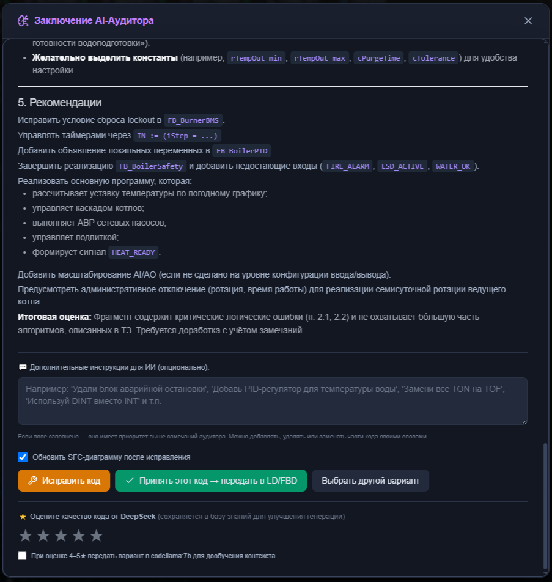

Аудитор выдаёт перечень замечаний. По кнопке «Исправить» — код правится и  **повторно проходит аудит в том же окне** . Аудит не закрывается после первого исправления — цикл продолжается, пока инженер не удовлетворён результатом.

Любой из провайдеров может выступать аудитором для кода другого. Например: DeepSeek генерирует, Claude проверяет — потому что у них разные «взгляды» на правильность кода. Это даёт дополнительный независимый взгляд.

Если хотите сохранить результат для дальнейшего обучения LLM, оцените качество кода.

Код можно редактировать прямо в программе, потом снова отправить на компиляцию и аудит. Цикл «правка → проверка → аудит» не ограничен.

---

## Шаг 11. Дополнительные проверки качества кода

Помимо компиляции, встроен **семантический анализатор** — он ловит то, что формально компилируется, но опасно на реальном объекте.

| Проверка                                             | Что находит                                                    | Важность |
| ------------------------------------------------------------ | ------------------------------------------------------------------------ | ---------------- |
| Бесконечный цикл без выхода          | Зависание контроллера                                | Критично |
| Повторное объявление переменной | Двойное объявление (без учёта регистра) | Важно       |
| Конфликт адресов                              | Два сигнала на одном адресе                       | Критично |
| Выход без защиты по времени           | Команда без таймера-защиты                        | Важно       |
| Неинициализированный таймер        | Таймер без уставки времени                        | Важно       |
| Кириллица в идентификаторах         | Нарушение стандарта в именах                    | Средне     |
| Деление без защиты                           | Возможное деление на ноль                          | Критично |

### Проверка безопасности и трассируемость требований

Компиляция отвечает на вопрос «синтаксис верный?», семантический анализатор — «нет ли опасных конструкций?». Но ни то, ни другое не проверяет **главное для АСУ ТП**: *делает ли логика то, что требует ТЗ* — сработает ли защита, не запустится ли механизм при аварии. Этот слой закрывает именно этот вопрос: программа **прогоняет сгенерированный код на встроенном соф-ПЛК** по сценариям безопасности и проверяет инварианты — правила, которые обязаны выполняться всегда.

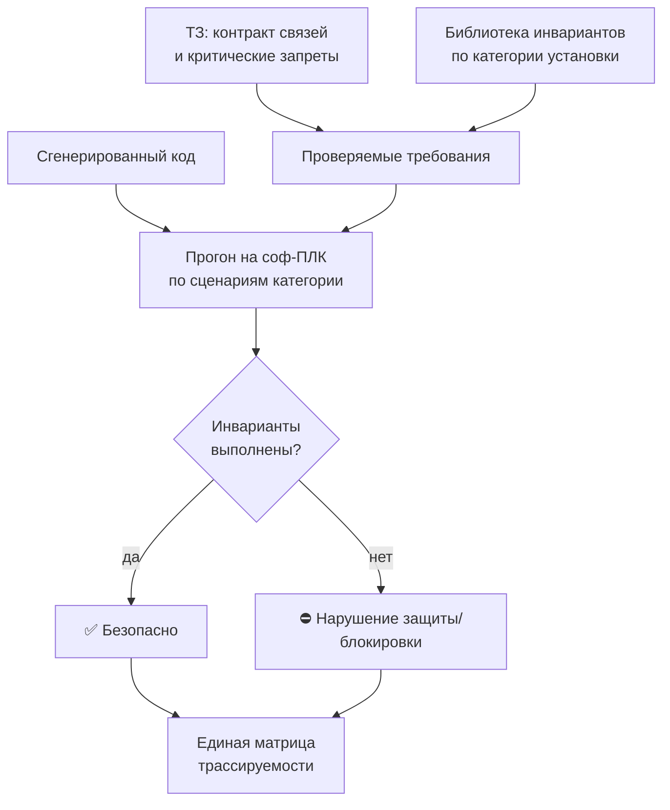

*Схема 4. Логика проверки безопасности: код исполняется на модельном ПЛК, требования берутся из библиотеки категории и из ТЗ, итог сводится в одну матрицу.*

---

## Шаг 12. Схемы и описание

Когда код готов, нажмите кнопку построения схем — программа создаст графику для редакторов **SFC** (последовательность), **LD** (релейные схемы), **FBD** (функциональные блоки) и технологическую **SCADA**-мнемосхему.

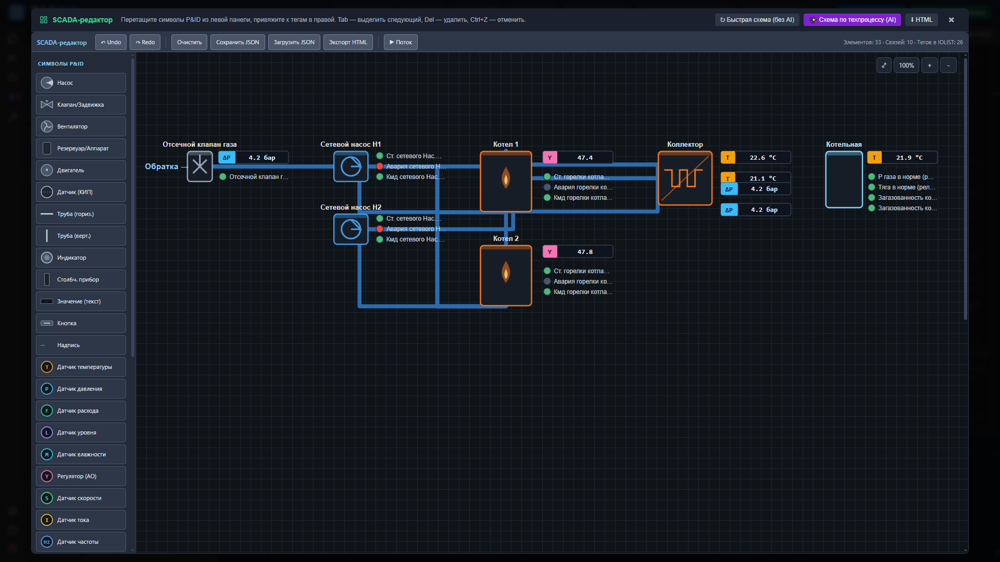

> 📷 Фото: **SCADA**-мнемосхема (для генерации нажмите кнопку Схема по техпроцессу (AI) и подождите несколькоо секунд).

> 📷 Фото: один из редакторов схем (например, FBD) с построенной диаграммой рядом с кодом.

Рядом с кодом также отображается текстовое описание программы на русском — назначение, режимы, блокировки, аварии. Это пригодится для пояснительной записки.

---

## Шаг 13. Экспорт в контроллер

Финальный шаг — кнопка **«Загрузить в контроллер»**. Она адаптирует код под выбранный контроллер и выгружает в нужном формате.

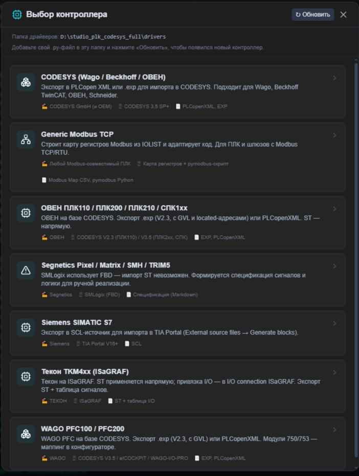

> 📷 Фото: меню экспорта: выбор контроллера и формата (PLCopen XML, .ST, DOCX по ГОСТ и др.).

Доступные форматы: PLCopen XML (CODESYS, TwinCAT), чистый `.ST`, пояснительная записка DOCX по ГОСТ, SCADA-мнемосхема HTML, SCL для Siemens, карта Modbus и другие.

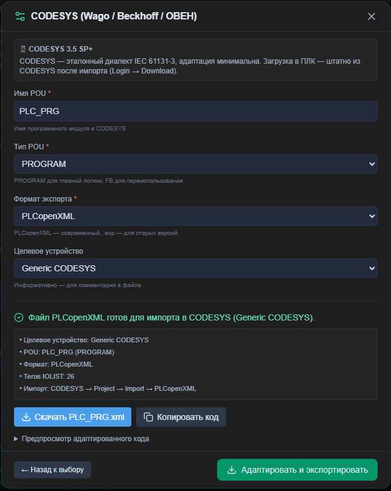

> 📷 Фото: сообщение об успешном экспорте и сохранённый файл в папке.

На этом цикл обычного режима завершён: у вас на руках проверенный код, схемы и документация.

---

## Частые вопросы

**Можно ли работать без ТЗ?**
Да, доступна генерация только по IOLIST, но результат будет менее точным — программа не узнает уставки и тонкости алгоритма.

**Что выбрать — matiec или CODESYS?**
Если код пойдёт в CODESYS — выбирайте CODESYS. Если нужна максимальная переносимость или строгая проверка — matiec.

**Почему появилось несколько вкладок с кодом?**
Вы настроили несколько ИИ-провайдеров. Каждый сгенерировал свой вариант; лучший отмечен значком.

**Код получился неполным.**
На больших IOLIST используйте «Надёжный режим» — он генерирует поблочно и не упирается в ограничение длины ответа.

---

*PLC AI Studio — Руководство по обычному режиму. Изображения размещайте в папке `docs_guides/` рядом с этим файлом.*
