# Руководство 2. Режим «Блок-объект»

> **Блок-объект** — направляющий режим для одного законченного объекта автоматизации (одна насосная станция, теплопункт, вентустановка, станок). Программа ведёт вас по **маршруту из 12 шагов** — от загрузки ТЗ до кода, проверенного на эмуляторе ПЛК и готового к загрузке в контроллер. Каждый шаг подсвечивается крупной кнопкой, прогресс сохраняется между перезапусками.
>
> Это руководство подробно, по шагам, объясняет, **что делает каждый пункт маршрута и как он работает**.

---

## Содержание

1. [Что такое «Блок-объект» и когда он нужен](#1-что-такое-блок-объект-и-когда-он-нужен)
2. [Чем отличается от обычного режима](#2-чем-отличается-от-обычного-режима)
3. [Что подготовить заранее](#3-что-подготовить-заранее)
4. [Маршрут работы: 12 шагов](#4-маршрут-работы-12-шагов)
5. [Шаг 1. Загрузить ТЗ](#шаг-1-загрузить-тз)
6. [Шаг 2. Загрузить теги (IOLIST)](#шаг-2-загрузить-теги-iolist)
7. [Шаг 3. Сценарий и модель ИИ (необязательно)](#шаг-3-сценарий-и-модель-ии-необязательно)
8. [Шаг 4. Взаимосвязи](#шаг-4-взаимосвязи)
9. [Шаг 5. Критические запреты](#шаг-5-критические-запреты)
10. [Шаг 6. Понимание системы](#шаг-6-понимание-системы)
11. [Шаг 7. Сгенерировать код](#шаг-7-сгенерировать-код)
12. [Шаг 8. Аудит и доводка логики](#шаг-8-аудит-и-доводка-логики)
13. [Шаг 9. Поведенческая проверка (Tier S)](#шаг-9-поведенческая-проверка-tier-s)
14. [Шаг 10. Проверка в ПЛК (Tier H) + кросс-проверка](#шаг-10-проверка-в-плк-tier-h--кросс-проверка)
15. [Шаг 11. Загрузить в контроллер](#шаг-11-загрузить-в-контроллер)
16. [Шаг 12. Отчёт и экспорт](#шаг-12-отчёт-и-экспорт)
17. [Сохранение блока в библиотеку (по желанию)](#сохранение-блока-в-библиотеку-по-желанию)
18. [Частые вопросы](#частые-вопросы)

---

## Настройка ИИ-провайдера

Откройте **Настройки ИИ-генерации** (кнопка с иконкой робота на правой панели активности).

> 📷 Фото: окно настроек ИИ: выбор провайдера, поле API-ключа, поле модели.

Здесь нужно:

1. Выбрать провайдера (DeepSeek бесплатная версия).
2. Ввести **API-ключ** этого провайдера (хранится локально у вас).
3. При желании — указать конкретную модель и температуру.

Для параллельного сравнения нескольких ИИ можно ввести ключи сразу для нескольких провайдеров — тогда они отработают одновременно, и вы выберете лучший результат.

> 💡 Если у вас активен пробный период — доступны все провайдеры. После его окончания на бесплатном тарифе останутся DeepSeek и Ollama; Anthropic/OpenAI/Gemini будут доступны по подписке.

Выбрать Агентов — это не одна нейросеть, а **связка шагов**, дающая более высокое качество ценой большего времени.

| Агент           | Как работает                                                                                                                                                                | В чём ценность                                                           |
| -------------------- | -------------------------------------------------------------------------------------------------------------------------------------------------------------------------------------- | ------------------------------------------------------------------------------------ |
| **R2-PLCGen**  | Планирует архитектуру → генерирует → проверяет компилятором → исправляет по найденным замечаниям. | Целостный план и самопроверка всей программы. |
| **Agents4PLC** | Подбирает похожие проверенные образцы → генерирует по ним → проверяет условия корректности.             | Опора на эталоны и проверка постусловий.           |
| **truST**      | Генерирует в строгом стиле (единый стандарт оформления, обработка фронтов, явный сброс выходов).       | Строгая, единообр                                                     |

---

## Пользовательские библиотеки (Загружайте перед началом работы проекта)

У каждого инженера и предприятия есть свои наработанные функциональные блоки: проверенный PID, фирменная логика управления насосом, блок аварийной сигнализации по внутренним стандартам. При обычной генерации ИИ изобретает их заново — каждый раз немного иначе.

**Пользовательские библиотеки решают это.** Загрузите свой `.st`-файл с готовыми FUNCTION_BLOCK — система прочитает интерфейсы ваших блоков (входы, выходы, типы) и при генерации будет вызывать именно их, а не изобретать аналоги. Код становится единообразным со всеми проектами организации.

Каждый блок можно временно отключить тумблером, не удаляя файл — удобно для экспериментов и переключения между версиями библиотеки. Состояние сохраняется между запусками.

---

## 1. Что такое «Блок-объект» и когда он нужен

Блок-объект — это работа над **одним типом оборудования или одной функцией** по пошаговому маршруту с встроенной проверкой. Например: насос с защитами и автоматикой ведущий/ведомый, вентустановка с регулированием температуры, клапан с контролем времени хода, горелка с последовательностью розжига.

Режим нужен, когда важно довести **один объект** до проверенного, чистого результата: не просто сгенерировать код, а прогнать его на программном эмуляторе ПЛК, сверить два независимых движка проверки и подготовить к загрузке в контроллер. Маршрут не даёт «перепрыгнуть» через важные этапы (например, не пустит на проверку в ПЛК, пока вы не провели аудит логики).

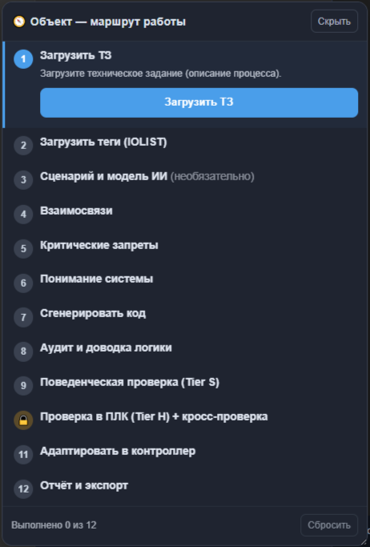

*Панель «Объект — маршрут работы»: 12 шагов, индикатор «Выполнено N из 12», текущий шаг подсвечен.*

---

## 2. Чем отличается от обычного режима

| Признак                                | Обычный режим                            | Блок-объект                                                                                                                                                       |
| --------------------------------------------- | ---------------------------------------------------- | --------------------------------------------------------------------------------------------------------------------------------------------------------------------------- |
| Как идёт работа                  | Свободно, на ваше усмотрение | По**направляющему маршруту** из 12 шагов                                                                                                |
| Фокус                                    | Вся установка / линия               | **Один** объект, доведённый до конца                                                                                                       |
| Проверка                              | Компиляция и базовый аудит    | + поведенческий прогон (Tier S), нативная проверка (Tier H),**кросс-проверка** двух движков                |
| Защита от ошибок порядка | Нет                                               | Проверка в ПЛК**заблокирована** до аудита логики                                                                               |
| Результат                            | Программа линии                        | Проверенный код объекта, готовый к загрузке в контроллер (и при желании — в библиотеку блоков) |

Технически генерация идёт по тому же проверенному конвейеру. Отличие маршрута — он **ведёт вас по шагам** и подключает встроенную проверку безопасности и трассируемость требований.

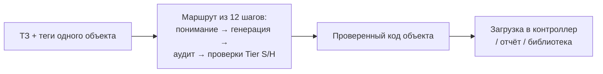

*Схема 1. Идея режима: один объект проводится по маршруту до проверенного, готового к выгрузке результата.*

---

## 3. Что подготовить заранее

- **ТЗ объекта** — краткое описание работы: условия пуска/останова, защиты, аварии, уставки. Для одного объекта это может быть всего несколько абзацев.
- **Теги объекта (IOLIST)** — небольшой список входов/выходов **только этого объекта**, таблицей (CSV) или JSON.

> ⚠️ **Важно для чистого результата.** Загружайте сигналы **одного** объекта, а не всей линии — иначе программа построит несколько блоков вместо одного.

Чем чётче описан объект, тем чище интерфейс на выходе: меньше лишних входов, понятные имена.

---

## 4. Маршрут работы: 12 шагов

Панель «Объект — маршрут работы» показывает логический порядок действий. Текущий шаг подсвечен крупной кнопкой; по нажатию маршрут сам открывает нужный элемент интерфейса и переходит к следующему шагу. Прогресс («Выполнено N из 12») сохраняется — можно закрыть и вернуться позже. Кнопка **«Сбросить»** обнуляет маршрут, **«Скрыть»** — прячет панель.

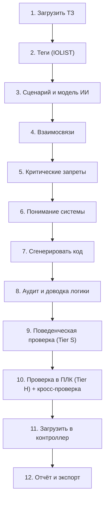

*Схема 2. Полный маршрут из 12 шагов.*

Шаги 1–6 — **подготовка и понимание** (что и как делаем). Шаг 7 — **генерация**. Шаги 8–10 — **доводка и проверка** (логика → поведение → ПЛК). Шаги 11–12 — **выгрузка** (в контроллер и в отчёт).

---

## Шаг 1. Загрузить ТЗ

**Что делает.** Загружает техническое задание — текстовое описание процесса, по которому ИИ будет писать логику.

**Как работает.** Нажмите **«Загрузить ТЗ»** и выберите файл (PDF или текст) либо вставьте описание. Программа извлекает из файла текст и берёт его за основу для «понимания системы» (шаг 6) и генерации (шаг 7). Для одиночного объекта описание может быть коротким — пара абзацев про условия пуска, защиты, аварии и уставки.

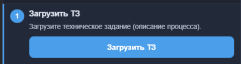

> 📷 Фото: нажата кнопка «Загрузить ТЗ», рядом — текст с уставками и условиями.

---

## Шаг 2. Загрузить теги (IOLIST)

**Что делает.** Загружает список тегов/каналов ввода-вывода объекта — из него строится «скелет» программы.

**Как работает.** Нажмите **«Загрузить IOLIST»** и выберите таблицу сигналов **только этого объекта**. По типам (DI/DO/AI/AO), именам и адресам программа детерминированно (без ИИ) формирует объявления переменных — это каркас, в который ИИ затем впишет логику. В журнале появится число распознанных сигналов.

> ⚠️ Если в таблице окажутся сигналы нескольких устройств, оставьте строки только нужного объекта — иначе блок получится «грязным».
>
> 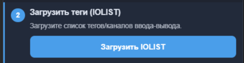

> 📷 Фото: загрузка небольшого IOLIST; в журнале — число сигналов.

---

## Шаг 3. Сценарий и модель ИИ

**Что делает.** Выбирает **сценарий** (категорию объекта) и, при желании, настраивает модель ИИ/провайдера.

**Как работает.** Сценарий — это категория, к которой относится объект (например, «Водоподготовка» для насосной, «Котельные» для горелки, «Конвейеры», «Энергетика», «Движение/приводы» и т.д.). Категория важна по двум причинам:

- она подбирает **профильный эталон** именно для этого типа объекта (для котла — последовательность розжига, для пожарной зоны — логику голосования);
- она включает **библиотеку инвариантов безопасности** этой категории, по которым потом пойдёт поведенческая проверка на шаге 9 (см. отдельное руководство по безопасности и трассируемости).

Шаг помечен «необязательно»: если сценарий уже выбран в левой панели, можно сразу идти дальше. Здесь же — выбор провайдера/модели ИИ.

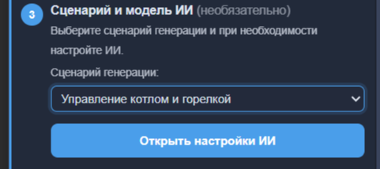

> 📷 Фото: выбор сценария (категории) и модели ИИ.

---

## Шаг 4. Взаимосвязи

**Что делает.** Позволяет описать зависимости и взаимосвязи внутри объекта — что от чего зависит, какие блокировки и режимы.

**Как работает.** В поле вписываете свободным текстом логику связей (например: «насос 2 не запускать, пока не подтверждён поток от насоса 1», «при аварии вентилятора закрыть заслонку»). По кнопке **«Сохранить и далее»** текст сохраняется и **добавляется в задание для ИИ** отдельным блоком `=== ВЗАИМОСВЯЗИ И ЗАВИСИМОСТИ СИСТЕМЫ ===`. Так нейросеть учитывает ваши связи при генерации. Текст переживает перезагрузку страницы.

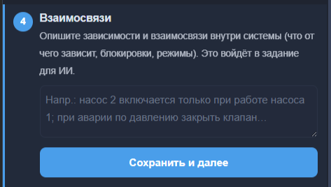

> 📷 Фото: поле «Взаимосвязи» с описанием блокировок.

---

## Шаг 5. Критические запреты

**Что делает.** Фиксирует, что обязательно и что **запрещено** — по одному правилу в строке.

**Как работает.** Вписываете правила (например: «запрещён пуск насоса при сухом ходе», «при пожаре закрыть газовый клапан», «E-stop снимает все приводы»). По кнопке **«Сохранить и далее»** они добавляются в задание для ИИ блоком `=== КРИТИЧЕСКИЕ ЗАПРЕТЫ (обязательны) ===`, и нейросеть обязана их соблюдать. Эти же требования по смыслу проверяются на шаге 9 поведенческой проверкой (категорийные инварианты безопасности).

> 💡 Формулируйте кратко и по делу — одна мысль в строке. Это самые важные правила безопасности объекта.

> 📷 Фото: поле «Критические запреты», список правил по строкам.

---

## Шаг 6. Понимание системы

**Что делает.** Это **контрольная точка перед генерацией**: программа собирает сводку всего, что вы задали, и просит подтвердить.

**Как работает.** Показывается сводка: ТЗ, теги, выбранный сценарий, взаимосвязи и критические запреты. Вы проверяете, что всё учтено, и нажимаете **«Подтвердить понимание»**. После этого взаимосвязи и запреты окончательно включаются в задание для ИИ. Смысл шага — поймать недопонимание **до** генерации, а не после.

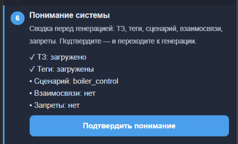

> 📷 Фото: сводка «Понимание системы» с кнопкой «Подтвердить понимание».

---

## Шаг 7. Сгенерировать код

**Что делает.** Формирует ST-код объекта по ТЗ, тегам, взаимосвязям и запретам.

**Как работает.** Нажмите **«▶ Сгенерировать код»**. Программа строит каркас из сигналов (имена, типы, адреса), а нейросеть пишет логику тела, учитывая всё, что собрано на шагах 1–6. Для одного объекта это быстро. Для ответственных объектов (защиты, безопасность) используйте **Надёжный режим** — он чинит код поблочно с проверкой компилятором и выбирает лучший из нескольких вариантов.

> 📷 Фото: нажата «Сгенерировать код», в журнале идёт построение.

---

## Шаг 8. Аудит и доводка логики

**Что делает.** Проверяет качество и логику кода и помогает довести её до конца **до** проверки в ПЛК.

**Как работает.** Нажмите **«Запустить аудит ИИ»**. Аудит разбирает код, указывает на слабые места и логические проблемы; при синтаксических ошибках используйте **«🔧 Исправить с помощью ИИ»**. Это ключевой шаг: маршрут специально **не пускает** на проверку в ПЛК (шаг 10), пока аудит не пройден — нет смысла гонять нативный компилятор по сырой логике.

> 📷 Фото: панель аудита с замечаниями и кнопкой исправления.

---

## Шаг 9. Поведенческая проверка (Tier S)

**Что делает.** Прогоняет код на **программном эмуляторе ПЛК** и строит матрицу трассируемости требований.

**Как работает.** Нажмите **«▶ Прогнать тесты»**. Движок **Tier S** (интерпретатор ST) исполняет код по сценариям и проверяет инварианты безопасности выбранной категории: например, «привод снимается при E-stop», «насос не работает при сухом ходе». Результат:

- **вердикты сценариев** (пройдено/нарушено), с жёстким приоритетом безопасности;
- **матрица трассируемости** — единая таблица, где требования ТЗ и проверки безопасности идут строками со статусом (доказано / нарушено / отсутствует); клик по строке подсвечивает соответствующие строки кода;
- **покрытие требований** в процентах.

Это «лёгкая», но содержательная проверка: она отвечает не «скомпилировалось ли», а «делает ли логика то, что должна». Подробности — в отдельном руководстве по безопасности и трассируемости.

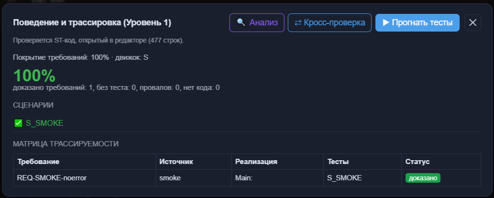

> 📷 Фото: панель Tier S — вердикты сценариев и матрица трассируемости.

---

## Шаг 10. Проверка в ПЛК (Tier H) + кросс-проверка

**Что делает.** Компилирует код **настоящим** компилятором IEC (matiec/`iec2c`) и сверяет два независимых движка проверки.

**Как работает.** Нажмите **«Открыть проверку Tier H»**. Движок **Tier H** — это нативная компиляция matiec (как на реальном контроллере), самый строгий уровень. Затем кнопка **«⇄ Кросс-проверка»** сверяет результаты **Tier S** (интерпретатор) и **Tier H** (нативный): если оба движка согласны — доверие к коду максимально; если расходятся — это место для внимания инженера.

> 🔒 **Почему пункт сначала заблокирован.** Проверка в ПЛК доступна только **после шага 8 (аудит и доводка)**. Если нажать раньше — появится подсказка «Сначала проведите аудит и доведите логику». Это защита от траты строгой проверки на ещё не доведённую логику (замок 🔒 на этом пункте в панели — именно про это).

> ℹ️ Поведенческая проверка и проверка в ПЛК (шаги 9–10), как и сам режим «Блок-объект», доступны в полной версии. После пробного периода (5 дней) при попытке открыть появится сообщение об активации (`support@plcstudio.ru`).

> 📷 Фото: результат Tier H (нативная компиляция) и кнопка «⇄ Кросс-проверка».

---

## Шаг 11. Адаптация в контроллер

**Что делает.** Адаптирует код под целевую платформу и выгружает файл для среды программирования.

**Как работает.** Нажмите **«Открыть „Загрузить в контроллер“»** и выберите платформу (CODESYS, ОВЕН, WAGO и т.д.). Программа подгоняет код под особенности выбранной среды и формирует файл, который вы открываете в своей системе программирования контроллера.

> 📷 Фото: окно выбора платформы (CODESYS/ОВЕН/WAGO) и кнопка выгрузки.

---

## Шаг 12. Отчёт и экспорт

**Что делает.** Формирует отчёт по ГОСТ и выгружает результат (ST-код / проект).

**Как работает.** Нажмите **«Сформировать отчёт»**. Программа собирает отчёт (включая результаты проверок) и даёт выгрузить ST-код или проект целиком. На этом маршрут завершён — «Выполнено 12 из 12».

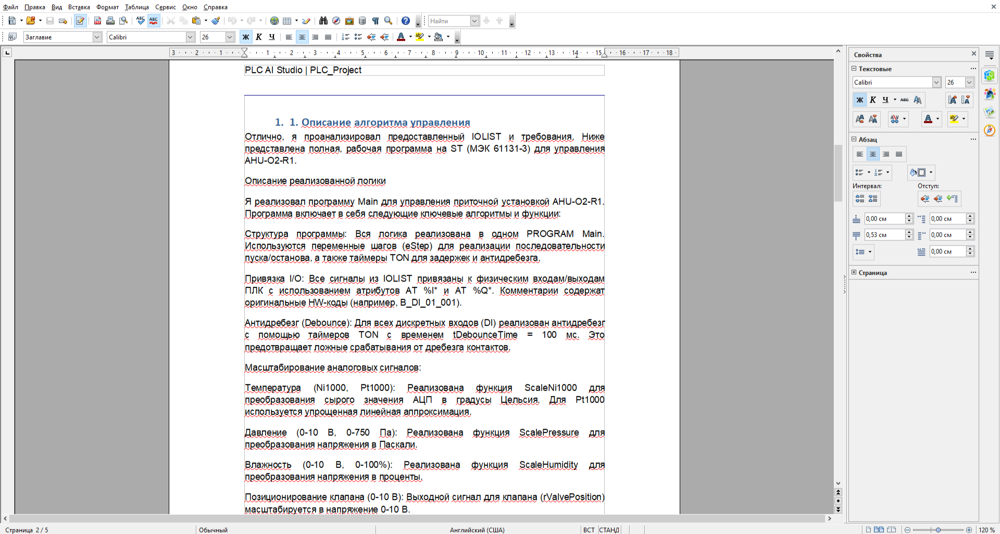

> 📷 Фото: сформированный отчёт по ГОСТ и кнопки экспорта.

---

## Сохранение блока в библиотеку (по желанию)

Доведённый объект можно сохранить как **переиспользуемый блок** в библиотеке (`user_library/` рядом с программой) — раздел загрузки своего `FB (.st)`. Тогда в будущих проектах (обычный режим или блок-проект) программа будет предлагать нейросети использовать именно ваш проверенный блок, а не писать его заново.

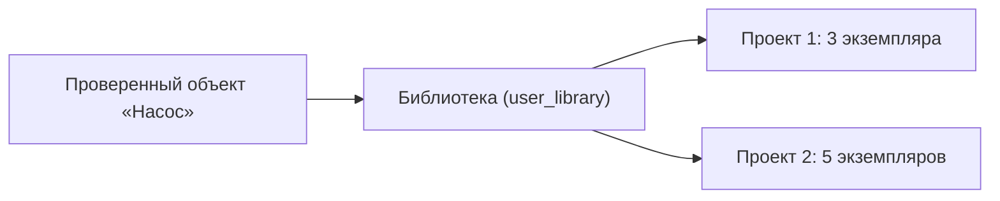

*Схема 3. Один проверенный блок — много проектов.*

> 💡 Это превращает разовую работу в актив: один раз аккуратно сделали «насос» — и дальше он подставляется единообразно и без расхождений.

---

## Частые вопросы

**Обязательно ли идти строго по шагам?**
Маршрут — направляющий: он подсвечивает логичный порядок и хранит прогресс, но жёстко заблокирован только один переход — проверка в ПЛК (шаг 10) после аудита (шаг 8). Остальное можно делать в удобном темпе.

**Чем Tier S отличается от Tier H?**
Tier S — программный интерпретатор ST (быстрая поведенческая проверка логики и безопасности). Tier H — нативная компиляция matiec, как на реальном контроллере (самая строгая). Кросс-проверка сверяет их между собой: согласие двух движков = высокое доверие.

**Что делают «Взаимосвязи» и «Критические запреты» технически?**
Их текст добавляется в задание для ИИ отдельными блоками, поэтому нейросеть учитывает связи и обязана соблюдать запреты. Запреты по смыслу проверяются и поведенческой проверкой категории на шаге 9.

**Почему проверка в ПЛК сначала недоступна (замок)?**
Чтобы не запускать строгую нативную проверку по ещё не доведённой логике. Сначала аудит и доводка (шаг 8) — затем Tier H разблокируется.

**Куда сохраняется блок для переиспользования?**
В папку `user_library/` рядом с программой. Туда можно класть `.st`-файлы и вручную.

**Сбросить маршрут?**
Кнопка «Сбросить» внизу панели обнуляет прогресс; «Скрыть» — прячет панель, не теряя прогресс.

---

*PLC AI Studio — Руководство по режиму «Блок-объект». Изображения размещайте в папке `image/Руководство_2_Блок_объект/` рядом с этим файлом.*
