# Руководство 3. Режим «Блок-проект»

> **Блок-проект** («Комплекс») — направляющий режим для объекта из **нескольких систем**, связанных общими сигналами (котельная + водоподготовка + пожарная сигнализация, где есть общие «Пожар», «Тепло готово», «Авария питания»). Программа ведёт вас по **маршруту из 7 шагов**: загрузка архива систем → категории → связи → запреты → распределение по контроллерам → понимание → генерация и совместная проверка.
>
> На ключевых шагах **ИИ предлагает** (категории, связи, распределение), а инженер **принимает или правит**. Это руководство подробно, по шагам, объясняет, **что делает каждый пункт маршрута и как он работает**.

---

## Содержание

1. [Что такое «Блок-проект» и когда он нужен](#1-что-такое-блок-проект-и-когда-он-нужен)
2. [Чем отличается от других режимов](#2-чем-отличается-от-других-режимов)
3. [Что подготовить заранее](#3-что-подготовить-заранее)
4. [Маршрут работы: 7 шагов](#4-маршрут-работы-7-шагов)
5. [Шаг 1. Архив систем (ZIP)](#шаг-1-архив-систем-zip)
6. [Шаг 2. Категории систем](#шаг-2-категории-систем)
7. [Шаг 3. Взаимосвязи (общее ТЗ)](#шаг-3-взаимосвязи-общее-тз)
8. [Шаг 4. Критические запреты](#шаг-4-критические-запреты)
9. [Шаг 5. Распределение по контроллерам](#шаг-5-распределение-по-контроллерам)
10. [Шаг 6. Понимание системы](#шаг-6-понимание-системы)
11. [Шаг 7. Генерация и проверка](#шаг-7-генерация-и-проверка)
12. [Отчёт, сборка и экспорт (после маршрута)](#отчёт-сборка-и-экспорт-после-маршрута)
13. [Частые вопросы](#частые-вопросы)

---

## Настройка ИИ-провайдера

Откройте **Настройки ИИ-генерации** (кнопка с иконкой робота на правой панели активности).


> 📷 Фото: окно настроек ИИ: выбор провайдера, поле API-ключа, поле модели.

Здесь нужно:

1. Выбрать провайдера (DeepSeek бесплатная версия).
2. Ввести **API-ключ** этого провайдера (хранится локально у вас).
3. При желании — указать конкретную модель и температуру.

Для параллельного сравнения нескольких ИИ можно ввести ключи сразу для нескольких провайдеров — тогда они отработают одновременно, и вы выберете лучший результат.

> 💡 Если у вас активен пробный период — доступны все провайдеры. После его окончания на бесплатном тарифе останутся DeepSeek и Ollama; Anthropic/OpenAI/Gemini будут доступны по подписке.

Выбрать Агентов — это не одна нейросеть, а **связка шагов**, дающая более высокое качество ценой большего времени.

| Агент           | Как работает                                                                                                                                                                | В чём ценность                                                           |
| -------------------- | -------------------------------------------------------------------------------------------------------------------------------------------------------------------------------------- | ------------------------------------------------------------------------------------ |
| **R2-PLCGen**  | Планирует архитектуру → генерирует → проверяет компилятором → исправляет по найденным замечаниям. | Целостный план и самопроверка всей программы. |
| **Agents4PLC** | Подбирает похожие проверенные образцы → генерирует по ним → проверяет условия корректности.             | Опора на эталоны и проверка постусловий.           |
| **truST**      | Генерирует в строгом стиле (единый стандарт оформления, обработка фронтов, явный сброс выходов).       | Строгая, единообр                                                     |


---

## Пользовательские библиотеки (Загружайте перед началом работы проекта)

У каждого инженера и предприятия есть свои наработанные функциональные блоки: проверенный PID, фирменная логика управления насосом, блок аварийной сигнализации по внутренним стандартам. При обычной генерации ИИ изобретает их заново — каждый раз немного иначе.


**Пользовательские библиотеки решают это.** Загрузите свой `.st`-файл с готовыми FUNCTION_BLOCK — система прочитает интерфейсы ваших блоков (входы, выходы, типы) и при генерации будет вызывать именно их, а не изобретать аналоги. Код становится единообразным со всеми проектами организации.

Каждый блок можно временно отключить тумблером, не удаляя файл — удобно для экспериментов и переключения между версиями библиотеки. Состояние сохраняется между запусками.

---

## 1. Что такое «Блок-проект» и когда он нужен

Блок-проект нужен, когда объект состоит из **нескольких подсистем**, которые работают вместе и обмениваются сигналами:

- **Котельная**: горелка + насосы контура + водоподготовка + диспетчеризация + пожарная сигнализация.
- **Очистные сооружения**: приёмная камера + аэротенки + обезвоживание + воздуходувки.
- **Производственная линия**: подача сырья + обработка + упаковка + транспорт.

Между подсистемами есть общие сигналы: пожар останавливает всё, «тепло готово» разрешает пуск потребителей, авария питания переводит в безопасное состояние. Маршрут помогает корректно описать эти связи, раздать системы по контроллерам и проверить, что взаимные блокировки действительно работают.

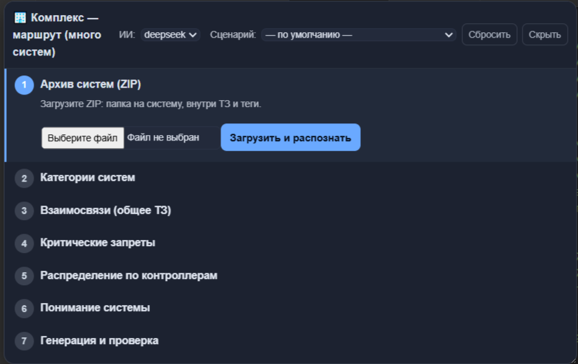

> 📷 Фото: Комплекс — маршрут (много систем)

*Панель «Комплекс — маршрут (много систем)»: вверху выбор ИИ и сценария, ниже — 7 шагов маршрута.*

---

## 2. Чем отличается от других режимов

| Признак    | Обычный                        | Блок-объект           | **Блок-проект**                                                                               |
| ----------------- | ------------------------------------- | ------------------------------- | ------------------------------------------------------------------------------------------------------------- |
| Масштаб    | одна установка           | один объект           | **комплекс из систем**                                                                  |
| Вход          | IOLIST + ТЗ                         | ТЗ + теги объекта  | **архив (ZIP): папка на систему с ТЗ и тегами**                            |
| Связи        | внутри установки       | внутри объекта     | **межсистемные сигналы (контракт связей)**                             |
| Помощь ИИ | генерация                    | генерация              | + ИИ**предлагает** категории, связи, распределение по ПЛК   |
| Проверка  | компиляция/аудит       | Tier S/H по объекту    | +**ко-симуляция** всех систем вместе (взаимные блокировки) |
| Выход        | программа установки | проверенный блок | **проект комплекса** по системам                                               |

Каждая подсистема внутри блок-проекта генерируется **тем же** проверенным конвейером, что и одиночный объект. Сверху добавляются: контракт межсистемных связей, распределение по контроллерам и совместная проверка.

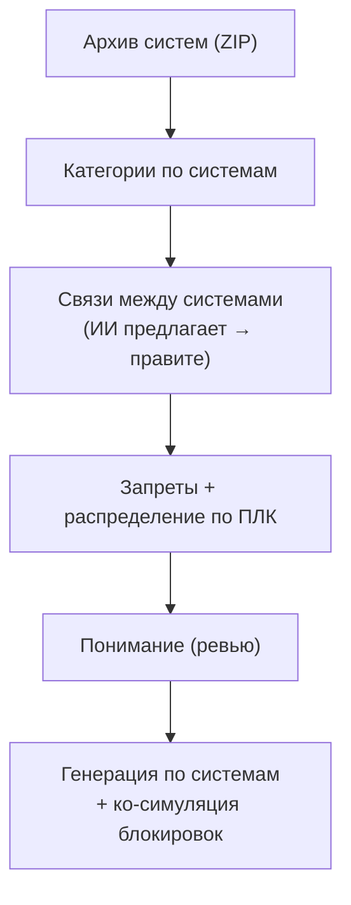

*Схема 1. Идея режима: комплекс описывается по системам и связям, затем генерируется и проверяется целиком.*

---

## 3. Что подготовить заранее

Главный вход — **ZIP-архив**, где **на каждую систему своя папка**, а внутри — её **ТЗ и теги (IOLIST)**:

```
complex.zip
├── kotelnaya/      (ТЗ + IOLIST котельной)
├── vodopodgotovka/ (ТЗ + IOLIST водоподготовки)
└── pozharnaya/     (ТЗ + IOLIST пожарной сигнализации)
```

> 💡 Давайте папкам понятные имена по системам — так программа точнее разложит сигналы и определит типы. ТЗ может быть своё у каждой системы или одно общее (описывается на шаге 3).
>
> 

---

## 4. Маршрут работы: 7 шагов

Панель «Комплекс — маршрут (много систем)» ведёт по шагам: текущий подсвечен, прогресс сохраняется между перезапусками (можно закрыть и вернуться). Вверху панели — выбор **модели ИИ** (например, `deepseek`) и **сценария** по умолчанию для систем. Кнопка **«Сбросить»** обнуляет маршрут, **«Скрыть»** — прячет панель.

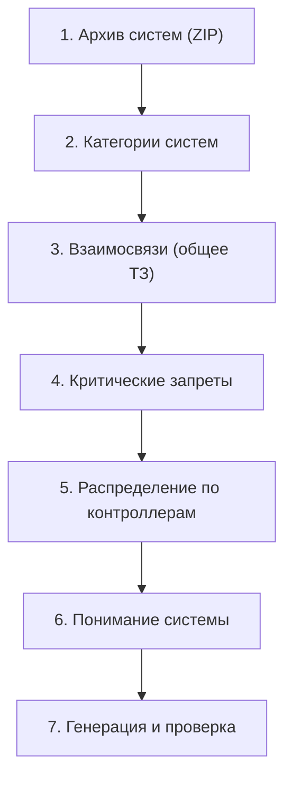

*Схема 2. Полный маршрут из 7 шагов.*

На шагах 2, 3 и 5 **ИИ предлагает** вариант (тип системы, связи, раскладку по ПЛК), а вы **принимаете или правите** — решение всегда за инженером.

---

## Шаг 1. Архив систем (ZIP)

**Что делает.** Загружает архив комплекса и распознаёт, из каких систем он состоит.

**Как работает.** Нажмите **«Выберите файл»**, укажите ваш ZIP (папка на систему, внутри ТЗ и теги), затем **«Загрузить и распознать»**. Программа распаковывает архив, находит в каждой папке ТЗ и IOLIST и формирует список систем с числом сигналов в каждой. Это основа для всех следующих шагов.

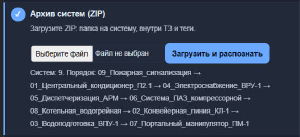

> ⚠️ Проверьте список распознанных систем: все ли подсистемы найдены и не «слиплись» ли две в одну. Если что-то не так — поправьте имена/структуру папок в архиве и загрузите заново.

> 📷 Фото: загрузка ZIP; в журнале — найденные системы и число сигналов.

---

## Шаг 2. Категории систем

**Что делает.** Задаёт **тип (категорию)** каждой распознанной системы.

**Как работает.** Для каждой системы программа подставляет предполагаемую категорию (водоподготовка, котельные, конвейеры, электроснабжение/АВР-РЗА, пожарная сигнализация и т.д.) — проверьте и при необходимости поправьте. Категория важна вдвойне: она подбирает **профильный эталон** для системы и включает **библиотеку инвариантов безопасности** этой категории, по которым система будет проверяться на шаге 7.

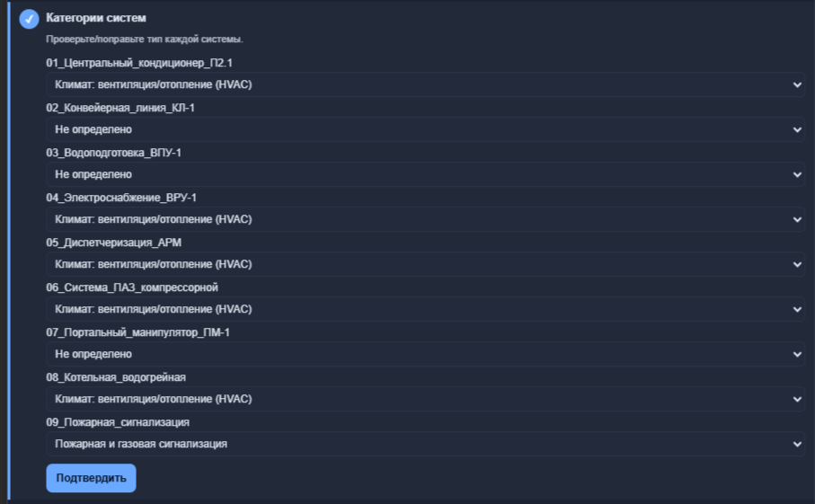

> 📷 Фото: список систем с выпадающими списками категорий.

---

## Шаг 3. Взаимосвязи (общее ТЗ)

**Что делает.** Описывает, **как системы работают вместе** — общие сигналы и взаимные блокировки. Это формирует «контракт связей» комплекса.

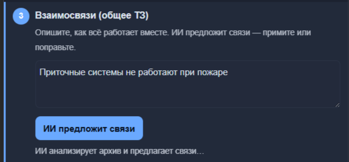

**Как работает.** Опишите общее ТЗ связей словами, либо нажмите предложение ИИ — программа проанализирует весь архив и **предложит связи** (какой сигнал из какой системы кому передаётся, например «Пожар» из пожарной сигнализации читают котельная и водоподготовка). Вы **принимаете или правите** список. Принятые связи становятся **контрактом**: производитель сигнала → потребитель → имя сигнала.

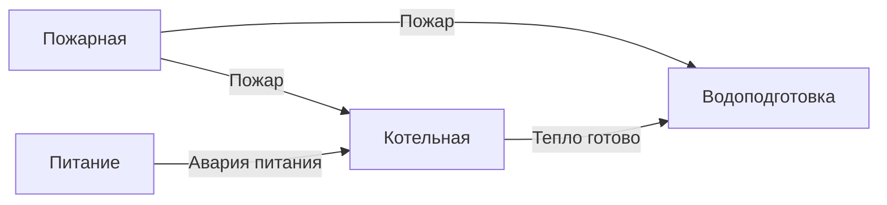

*Схема 3. Пример контракта связей: общие сигналы задают порядок и блокировки.*

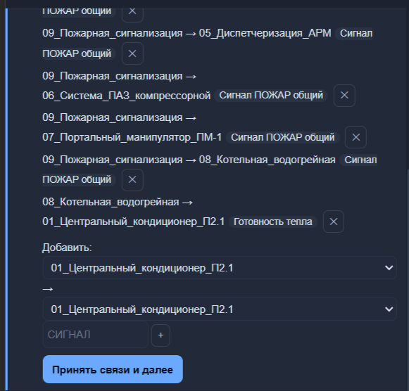

> 💡 Если выбрана модель ИИ (вверху панели), связи предлагает настоящий ИИ по всему архиву; без ИИ — эвристика по совпадению сигналов.

> 📷 Фото: предложенные связи; кнопки «принять / поправить».

---

## Шаг 4. Критические запреты

**Что делает.** Фиксирует обязательные правила и запреты для всего комплекса.

**Как работает.** Вписываете правила по одному в строке (например: «при пожаре остановить котельную и закрыть газовый клапан», «не запускать насосы при аварии питания»). Эти запреты **подмешиваются в задание каждой системы** при генерации, чтобы все подсистемы соблюдали единые требования безопасности. По смыслу они также участвуют в проверке на шаге 7.

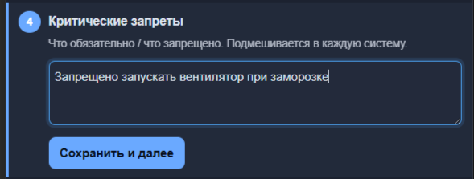

> 📷 Фото: поле «Критические запреты», список правил по строкам.

---

## Шаг 5. Распределение по контроллерам

**Что делает.** Решает, **какие системы в какой ПЛК** попадут (для комплексов на нескольких контроллерах).

**Как работает.** Программа **предлагает раскладку** систем по контроллерам (ИИ или эвристика) — вы принимаете или правите. Это влияет на то, какие связи становятся **межконтроллерными** (их нужно прокинуть между ПЛК), а какие остаются внутри одного контроллера.

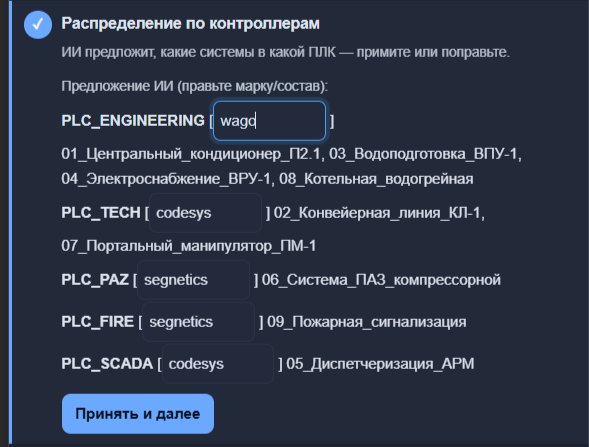

> 💡 Если весь комплекс на одном ПЛК — просто оставьте все системы в одном контроллере.

> 📷 Фото: предложенное распределение систем по контроллерам.

---

## Шаг 6. Понимание системы

**Что делает.** Это **контрольная точка перед генерацией**: сводка всего проекта и список «что уточнить».


**Как работает.** Программа собирает сводку: системы, их категории, связи, запреты, распределение по ПЛК — и показывает, что стоит уточнить (неоднозначные связи, незаданные категории). Вы проверяете и **подтверждаете**. Смысл — поймать недопонимание **до** генерации всего комплекса (которая может быть долгой).

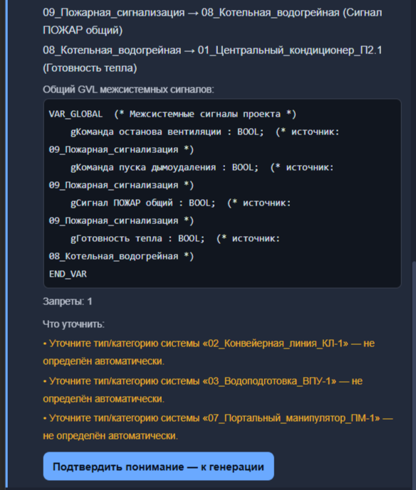

> 📷 Фото: сводка «Понимание системы» и список уточнений.

---

## Шаг 7. Генерация и проверка

**Что делает.** Генерирует код **по каждой системе** и прогоняет **сценарий взаимных блокировок** всего комплекса.

**Как работает.** Нажмите генерацию. Программа:

1. **Генерирует каждую систему** своим проходом конвейера (каркас → логика), учитывая её категорию, связи и общие запреты;
2. **Проверяет каждую систему** по её категории (инварианты безопасности) и по **контракту**: реально ли система использует в коде те межсистемные сигналы, которые обязана читать (если «Пожар» в контракте есть, а в коде котельной не используется — это подсвечивается как нереализованная блокировка);
3. **Ко-симуляция (Tier S)**: POU всех систем запускаются **в одном цикле через общую таблицу межсистемных сигналов** — так проверяется, что взаимные блокировки срабатывают вживую (подали «Пожар» → котельная остановилась).

   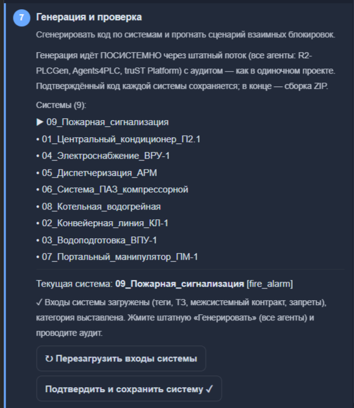

   > #### КАК РАБОТАТЬ!
   >

   > ### **Стрелка ▶ 09_Пожарная сигнализация - показывает, какая категория готова для работы. Далее нажимаем кнопки:**
   >

   > ### **После проведения всех работ с кодом как в обычном режиме, нажимаем кнопку "Подтвердить и сохранить систему".**
   >

Результат — по каждой подсистеме: код, статус проверки, нереализованные блокировки; и общий итог по взаимным блокировкам. Подробнее о проверках безопасности и трассируемости — в отдельном руководстве.

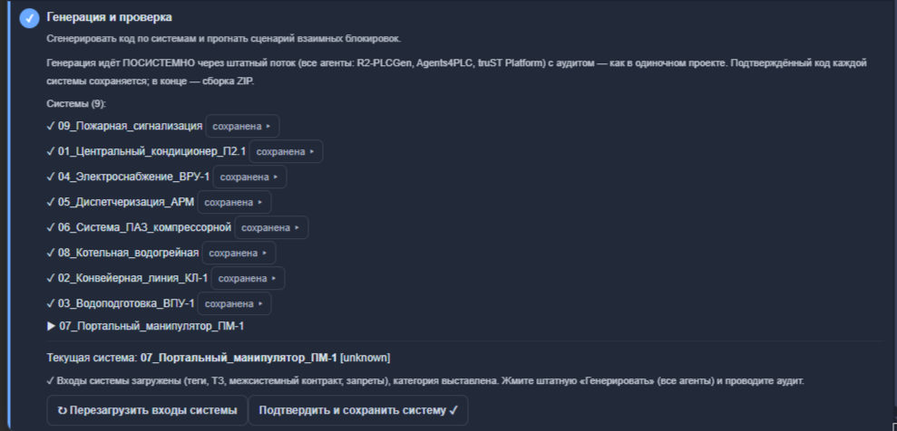

> ### Если нужно изменть код в какой либо предыдущей категории, нажмите на кнопку "сохранена" возле нужной категории с правой стороны и код появится на экране.

> 📷 Фото: результаты генерации по системам и итог ко-симуляции взаимных блокировок.

> ℹ️ Режим «Блок-проект», как и его проверки, доступен в полной версии. После пробного периода (5 дней) при попытке появится сообщение об активации (`support@plcstudio.ru`).

---

## Отчёт, сборка и экспорт (после маршрута)

Когда комплекс сгенерирован и проверен, доступны:

- **Пояснительная записка** — единый отчёт по ГОСТ на весь проект (включая результаты проверок).
- **Сборка комплекса** — объединение систем в единый проект с общей таблицей межсистемных (g-) сигналов.
- **Экспорт** в те же форматы, что и в обычном режиме (PLCopen XML, `.ST`, DOCX по ГОСТ, SCADA HTML и др.), но применённые ко всему комплексу.

  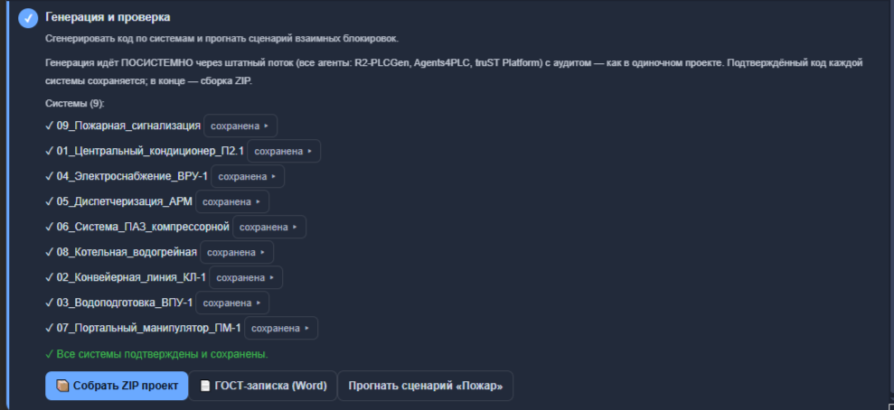

> 📷 Фото: пояснительная записка по ГОСТ и экспорт проекта комплекса.

---

## Частые вопросы

**Чем блок-проект лучше, чем сгенерировать каждую систему отдельно?**
Он учитывает **контракт межсистемных связей**, проверяет, что блокировки реально реализованы в коде, и прогоняет **ко-симуляцию** всех систем вместе — а на выходе даёт согласованный проект, а не разрозненные программы.

**Что значит «ИИ предлагает → инженер правит»?**
На шагах «Категории», «Взаимосвязи» и «Распределение по контроллерам» программа предлагает вариант (настоящим ИИ, если выбрана модель вверху панели, иначе эвристикой), но финальное решение и правки — за вами.

**Как именно подаётся вход?**
ZIP-архивом: одна папка на систему, внутри её ТЗ и теги (IOLIST). Понятные имена папок повышают точность разбора.

**Что проверяет «ко-симуляция»?**
Она запускает код всех систем в одном цикле через общую таблицу межсистемных сигналов и проверяет, что взаимные блокировки срабатывают (например, сигнал «Пожар» из одной системы действительно останавливает другую).

**Можно ли использовать свои блоки из библиотеки?**
Да. Блоки, сохранённые в режиме [Блок-объект](Руководство_2_Блок_объект.md), программа подставляет и здесь — единообразно во всех подсистемах.

**Прогресс маршрута сохраняется?**
Да, состояние проекта сохраняется — можно закрыть панель и продолжить позже. «Сбросить» обнуляет маршрут.

---

*PLC AI Studio — Руководство по режиму «Блок-проект». Изображения размещайте в папке `image/Руководство_3_Блок_проект/` рядом с этим файлом.*
