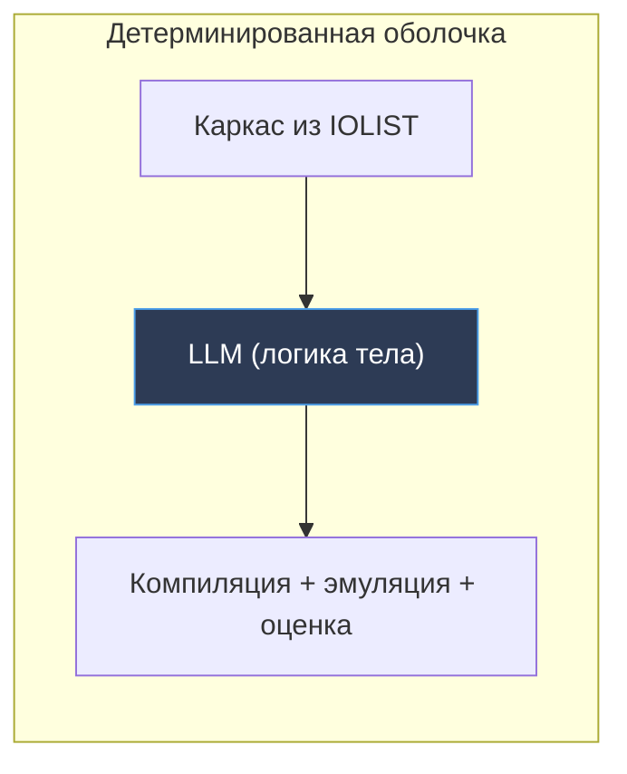
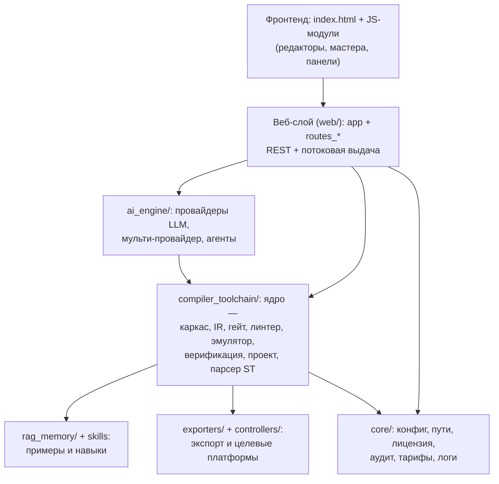
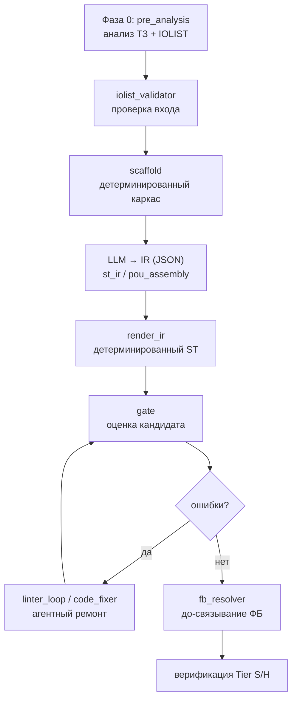
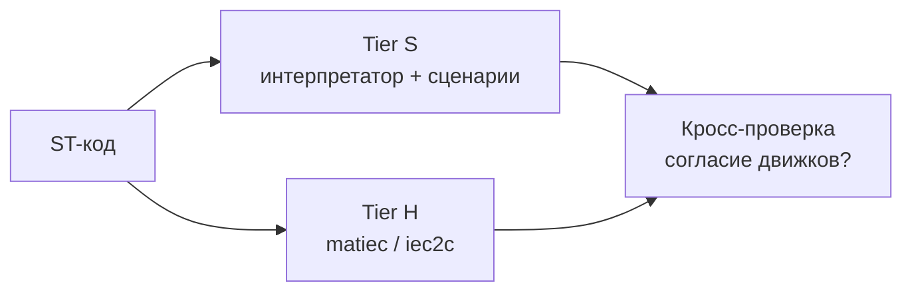
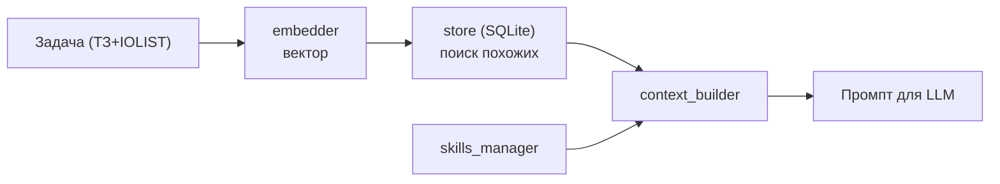
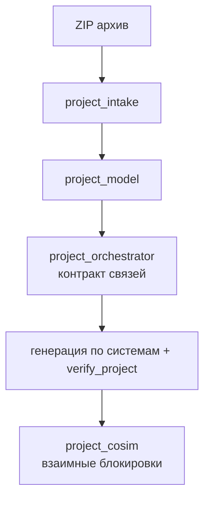
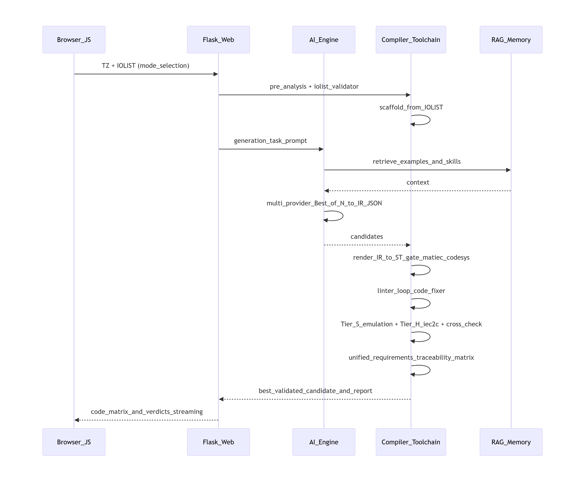

# PLC AI Studio — Техническая документация

> Документ для разработчиков. Описывает архитектуру, применённые технологические и
> логические методы, файловую структуру и поток данных программы. **Исходный код
> намеренно не приводится** — только принципы работы модулей и их взаимодействие.
> Пользовательская часть вынесена в отдельное `PLC_AI_Studio_User_Guide.md`.

---

## Содержание

1. [Назначение и идея](#1-назначение-и-идея)
2. [Технологический стек](#2-технологический-стек)
3. [Архитектура верхнего уровня](#3-архитектура-верхнего-уровня)
4. [Файловая структура](#4-файловая-структура)
5. [Ядро: конвейер генерации кода](#5-ядро-конвейер-генерации-кода)
6. [Двухуровневая верификация (Tier S / Tier H)](#6-двухуровневая-верификация-tier-s--tier-h)
7. [Требования, безопасность и трассируемость](#7-требования-безопасность-и-трассируемость)
8. [Разбор и анализ ST-кода](#8-разбор-и-анализ-st-кода)
9. [Мульти-агентные и ансамблевые методы](#9-мульти-агентные-и-ансамблевые-методы)
10. [Память, навыки и контекст (RAG)](#10-память-навыки-и-контекст-rag)
11. [Режим «Блок-проект»: оркестрация комплекса](#11-режим-блок-проект-оркестрация-комплекса)
12. [Целевые платформы и экспорт](#12-целевые-платформы-и-экспорт)
13. [Визуальные редакторы (фронтенд)](#13-визуальные-редакторы-фронтенд)
14. [Инфраструктура ядра (core)](#14-инфраструктура-ядра-core)
15. [Лицензирование и тарификация](#15-лицензирование-и-тарификация)
16. [Сервинг, параллелизм и потоковая выдача](#16-сервинг-параллелизм-и-потоковая-выдача)
17. [Сборка и дистрибуция](#17-сборка-и-дистрибуция)
18. [Тестирование](#18-тестирование)
19. [Сквозной поток данных](#19-сквозной-поток-данных)

---

## 1. Назначение и идея

PLC AI Studio — оффлайн-приложение для Windows, которое из **технического задания** и
**списка сигналов (IOLIST)** формирует программы на языке **Structured Text (IEC 61131-3)**,
проверяет их и готовит к загрузке в контроллер.

Ключевой инженерный принцип системы: **не доверять «сырому» выводу нейросети**.
Везде, где это возможно, ИИ заключён в детерминированные рамки — каркас программы
строится без ИИ, результат прогоняется через настоящий компилятор и программный
эмулятор ПЛК, оценивается по объективным критериям, а нарушение безопасности жёстко
понижает оценку кандидата. ИИ отвечает за «творческую» часть (логику тела POU), а
корректность гарантируют детерминированные слои вокруг него.

*Схема 1. ИИ — внутри детерминированной оболочки, а не вместо неё.*

---

## 2. Технологический стек

| Слой                              | Технология                                                               | Роль в программе                                  |
| ------------------------------------- | ---------------------------------------------------------------------------------- | --------------------------------------------------------------- |
| Backend                               | **Python 3.12**, **Flask**                                             | веб-приложение, REST-маршруты              |
| Сервер                          | **Waitress** (по умолч.), **gunicorn** (gevent), Werkzeug (dev) | WSGI-сервинг на `127.0.0.1:8050`                     |
| Frontend                              | **Vanilla JS** (без фреймворка), HTML/CSS                       | интерфейс, редакторы, мастера          |
| Редактор кода             | **Monaco**                                                                   | подсветка/правка ST                              |
| Диаграммы                    | **Mermaid**                                                                  | SFC/схемы в UI и отчётах                          |
| Разбор ST                       | **lark** (LALR-парсер + грамматика ST)                       | парсинг, ремонт, анализ                      |
| Данные                          | **SQLite**                                                                   | RAG-память, журнал аудита                     |
| RAG-эмбеддинги              | **sentence-transformers / torch** (ленивый импорт)              | векторизация примеров                       |
| Табличные данные       | **pandas / numpy**                                                           | разбор IOLIST                                             |
| Документы                    | **python-docx**                                                              | пояснительная записка по ГОСТ         |
| Криптография              | **cryptography** (Ed25519)                                                   | асимметричное лицензирование         |
| Сетевые вызовы           | **requests**                                                                 | обращение к облачным LLM                      |
| Нативный компилятор | **matiec** (`iec2c`)                                                       | строгая проверка IEC 61131-3 (Tier H)            |
| Локальный LLM                | **Ollama**                                                                   | приватная генерация без интернета |
| Облачные LLM                  | DeepSeek, OpenAI, Anthropic, Google Gemini                                         | генерация (по ключам)                          |
| Упаковка                      | **PyInstaller** (onedir)                                                     | сборка `.exe`                                           |
| Установщик                  | **Inno Setup 6**                                                             | дистрибутив для Windows                           |

> Тяжёлые ML-библиотеки (sentence-transformers, torch) импортируются **лениво** —
> чтобы старт сервера не падал на машинах без них; RAG в этом случае деградирует
> мягко (работает без семантического поиска).

---

## 3. Архитектура верхнего уровня

Чёткое разделение на слои. Запрос из браузера проходит сверху вниз; ядро (генерация
и верификация) не зависит от Flask и может вызываться автономно (что используют тесты).

*Схема 2. Слои приложения. Стрелки — направление вызова.*

Три пользовательских режима (обычный, «Блок-объект», «Блок-проект») — это три точки
входа в **один и тот же** конвейер ядра, отличающиеся гранулярностью задачи и набором
проверок.

---

## 4. Файловая структура

Ниже — назначение каталогов и ключевых модулей. Имена файлов приведены без кода.

### `core/` — инфраструктура

| Модуль                                                       | Назначение                                                                                                                                                     |
| ------------------------------------------------------------------ | ------------------------------------------------------------------------------------------------------------------------------------------------------------------------ |
| `config.py`                                                      | централизованная конфигурация (модели LLM, лимиты, хост/порт, пути)                                                  |
| `paths.py`                                                       | разделение `BASE_DIR` (ресурсы) и `DATA_DIR` (записываемые данные), портативный режим, серийник тома |
| `license.py`                                                     | проверка Ed25519-лицензии, отпечаток железа, авто-триал                                                                          |
| `tier_gate.py`                                                   | гейтинг функций по тарифу (free/full) на сервере                                                                                          |
| `audit_log.py`                                                   | журнал событий в SQLite                                                                                                                                    |
| `bug_reporter.py`                                                | тихий сбор отчёта об ошибке (ZIP → SMTP)                                                                                                         |
| `logger.py`, `exceptions.py`, `auth.py`, `prompt_cache.py` | логирование, типы исключений, аутентификация, кэш промптов                                                             |

### `ai_engine/` — работа с LLM

| Модуль                                         | Назначение                                                                                                 |
| ---------------------------------------------------- | -------------------------------------------------------------------------------------------------------------------- |
| `ai_client.py`, `*_client.py`                    | единый интерфейс и адаптеры провайдеров (DeepSeek/OpenAI/Anthropic/Gemini/Ollama) |
| `multi_provider.py`                                | параллельная генерация во всех доступных ИИ (Best-of-N)                        |
| `prompts_manager.py`, `control_logic_prompts.py` | сборка системных/целевых промптов                                                      |
| `r2_plcgen.py`                                     | мульти-агентная схема R2-PLCGen (генератор + рефлектор)                         |
| `agents4plc.py`, `agents4plc_catalog.py`         | исследовательский подход Agents4PLC                                                           |
| `trust_platform.py`                                | статический анализатор по модели truST-platform                                         |
| `runtime_limits.py`                                | лимиты времени/токенов на вызовы                                                         |

### `compiler_toolchain/` — ядро (генерация + верификация)

| Группа                      | Модули                                                                                                        | Назначение                                                                                                                                           |
| --------------------------------- | --------------------------------------------------------------------------------------------------------------------------------- | -------------------------------------------------------------------------------------------------------------------------------------------------------------- |
| Подготовка              | `pre_analysis.py`, `iolist_validator.py`, `file_intake.py`                                                                  | анализ ТЗ и IOLIST**до** генерации, валидация входа                                                                    |
| Каркас                      | `scaffold.py`                                                                                                                   | детерминированное построение объявлений из IOLIST, канонические имена, разрешение ролей |
| Структура                | `st_ir.py`, `pou_assembly.py`                                                                                                 | промежуточное представление (JSON-IR) и POU-by-POU сборка                                                                     |
| Оценка                      | `gate.py`, `gen_benchmark.py`                                                                                                 | цикл «нормализация → проверка цели → оценка» для целей `matiec`/`codesys`                                    |
| Ремонт                      | `linter_loop.py`, `code_fixer.py`, `fb_resolver.py`                                                                         | агентный цикл правок, авто-фикс синтаксиса, до-связывание внешних ФБ                                  |
| Эмуляция                  | `st_simulator.py`, `behavioral_pass.py`, `native_runner.py`                                                                 | программный ПЛК (Tier S), прогон сценариев, выбор движка                                                               |
| Безопасность          | `behavior_rules.py`, `contract_rules.py`, `unified_requirements.py`                                                         | инварианты категорий, контрактные блокировки, единая матрица                                              |
| Трассируемость      | `traceability.py`, `requirements_recon.py`                                                                                    | требования↔код, реконструкция требований из кода                                                                    |
| Нативная проверка | `matiec_wrapper.py`                                                                                                             | вызов `iec2c` (Tier H)                                                                                                                                  |
| Анализ ST                   | `st_parser.py`, `st_ast.py`, `st_formatter.py`, `semantic_linter.py`, `semantic_validator.py`, `mermaid_validator.py` | разбор, CST, форматирование, семантические проверки                                                                   |
| Проект                      | `project_intake.py`, `project_model.py`, `project_orchestrator.py`, `project_cosim.py`                                    | разбор архива, модель проекта, контракт связей, ко-симуляция                                                 |
| Прочее                      | `library_manager.py`, `skills_manager.py`, `connectors.py`, `brownfield.py`, `multi_agent.py`                           | библиотека блоков, навыки, коннекторы платформ, анализ legacy-кода                                           |

### `web/` — веб-слой

| Файл                 | Назначение                                                                                                      |
| ------------------------ | ------------------------------------------------------------------------------------------------------------------------- |
| `app.py`               | сборка Flask-приложения, регистрация blueprint'ов                                            |
| `routes_api.py`        | основные маршруты генерации/экспорта, потоковая мульти-генерация |
| `routes_level1.py`     | режим «Блок-объект» (поведение, доводка, brownfield)                                     |
| `routes_project.py`    | режим «Блок-проект» (intake, контракт, ко-симуляция, генерация)              |
| `routes_ui.py`         | служебные маршруты UI, статус лицензии                                                     |
| `templates/index.html` | единая страница приложения                                                                        |
| `static/js/*`          | фронтенд-модули (см. §13)                                                                                |

### Прочие каталоги

| Каталог                                               | Назначение                                                                                                    |
| ------------------------------------------------------------ | ----------------------------------------------------------------------------------------------------------------------- |
| `rag_memory/`                                              | RAG-память:`store.py` (SQLite), `embedder.py` (эмбеддинги), `context_builder.py`, `seeds.py`    |
| `exporters/`                                               | `plcopen_xml.py` (PLCopen XML), `word_report.py` (DOCX по ГОСТ)                                               |
| `controllers/`, `drivers/`                               | адаптеры целевых ПЛК (CODESYS/ОВЕН/WAGO/Siemens/Segnetics/Tecon) и драйверы (Modbus TCP) |
| `behavior_rules/`                                          | пользовательские JSON-правила безопасности по категориям                 |
| `user_library/`                                            | пользовательские блоки (`.st`) и `plc_prompts.json`                                           |
| `bin/`, `lib/`                                           | бинарь `iec2c` и библиотеки matiec                                                                   |
| `build_kit/`                                               | спеки PyInstaller, установщик Inno Setup,`version_info.txt`, скрипты сборки               |
| `vendor_keygen/`                                           | генератор ключей лицензии (сторона поставщика)                                  |
| `benchmarks/`, `scenario_dbs/`, `training/`, `data/` | эталоны, базы сценариев, обучающие данные                                            |

> **`BASE_DIR` vs `DATA_DIR`.** Ресурсы (шаблоны, `plc_prompts.json`, `bin/`, `lib/`)
> читаются рядом с `.exe` (`BASE_DIR`); записываемые данные (БД, лог, лицензия,
> экспорт, метка триала) пишутся в `DATA_DIR` = `%LOCALAPPDATA%\PLC_AI_Studio` или, в
> портативном режиме, рядом с `.exe`. Это позволяет ставить программу в Program Files
> без прав администратора во время работы.

---

## 5. Ядро: конвейер генерации кода

Сердце системы — многоступенчатый конвейер, где каждая ступень снижает риск ошибки.

*Схема 3. Конвейер генерации одной программы.*

**Фаза 0 — `pre_analysis`.** До любой генерации анализируются ТЗ и IOLIST: что за
объект, какие сигналы, какие узкие места. Это убирает класс ошибок, когда модель
«не поняла» задачу.

**Валидация входа — `iolist_validator`.** IOLIST проверяется на корректность
(типы, дубликаты, адреса) до генерации.

**Каркас — `scaffold`.** Из IOLIST **без ИИ** строятся объявления переменных:
канонические имена сигналов, типы (BOOL/INT/REAL…), адреса. Здесь же — **разрешение
ролей**: абстрактные роли («E-stop», «команда пуска», «привод») сопоставляются с
реальными тегами по типу и описанию. Каркас — это «скелет», в который ИИ вписывает
только логику.

**Структурная генерация — `st_ir` + `pou_assembly`.** Вместо «сырого» ST модель
просит вернуть **структуру в JSON** (список POU: имя, вид, объявления, тело). JSON
валидируется схемой (`ir_json_schema`), затем **детерминированный рендерер**
(`render_ir`) превращает структуру в ST. Это резко снижает синтаксические ошибки:
модель свободна только в логике тела, а каркас и оформление — детерминированы.
`pou_assembly` обеспечивает генерацию и сборку POU-by-POU.

**Оценка — `gate`.** Кандидат прогоняется циклом «нормализация → проверка цели →
оценка» для двух целей: **`matiec`** (строгая компиляция IEC через `iec2c`) и
**`codesys`** (структурная проверка). Балл складывается из компилируемости, охвата
сигналов, модульности и **поведения** (см. §6–7). Нарушение safety жёстко
ограничивает балл сверху.

**Агентный ремонт — `linter_loop` (v3) + `code_fixer`.** Если есть ошибки, запускается
итеративный цикл правок со свойствами:

- **Best-of-N** — запоминается попытка с минимумом ошибок и возвращается именно она;
- **детекция застоя** — по хэшу кода: если правки не меняют результат, цикл прекращается;
- **анти-каскад** — дедупликация повторяющихся ошибок, чтобы не «лечить» одно и то же;
- **тайм-аут LLM** — защита от зависания на вызове модели.
  `code_fixer` — детерминированный авто-фикс типовых синтаксических ошибок (быстрее и
  дешевле, чем гонять LLM-рефлектор).

**До-связывание — `fb_resolver`.** Если код ссылается на внешние ФБ/функции, модуль
до-связывает их тела, чтобы фрагмент компилировался целиком.

---

## 6. Двухуровневая верификация (Tier S / Tier H)

Корректность проверяется двумя **независимыми** движками — это даёт перекрёстную
страховку.

**Tier S — программный ПЛК (`st_simulator` + `behavioral_pass`).** Интерпретатор ST
исполняет код по сценариям в виртуальных циклах ПЛК: подаёт входы, продвигает время,
читает выходы. На этом движке проверяются **поведенческие инварианты** — правила
«такого быть не должно никогда» (например, «привод снимается при E-stop»). Tier S
быстрый и отвечает на вопрос «**делает ли логика то, что должна**», а не «компилируется ли».

**Tier H — нативная компиляция (`matiec_wrapper` → `iec2c`).** Тот же код прогоняется
**настоящим** компилятором IEC 61131-3, как на реальном контроллере. Это самый строгий
уровень; `native_runner` выбирает доступный движок.

**Кросс-проверка.** Результаты Tier S (интерпретатор) и Tier H (нативный) сверяются:
согласие двух независимых реализаций = высокое доверие; расхождение — сигнал инженеру.

*Схема 4. Два независимых движка и их сверка.*

---

## 7. Требования, безопасность и трассируемость

Поверх верификации построен слой, замыкающий петлю «**что требовало ТЗ ↔ что
проверяем в коде**».

**Инварианты категорий — `behavior_rules`.** Для каждой категории установки
(водоподготовка, котельные, конвейеры, энергетика, движение, пожарная сигнализация
и др.) есть библиотека safety/functional-инвариантов в **ролях**; роли разрешаются в
реальные теги. Правила расширяются JSON-файлами в `behavior_rules/`.

**Ансамблевое согласие.** Если генерировали несколько ИИ, одни и те же проверки
прогоняются на коде каждого: совпали вердикты по блокировке — доверие выше;
расходятся — место помечается «нужен глаз инженера». Большинство не считается
истиной — это подсказка и мягкий тай-брейк, **не** переопределяющий гейт безопасности.

**Контракт ТЗ — `contract_rules`.** Из проекта и запретов ТЗ выводятся проверяемые
требования: (а) **трассировка межсистемных блокировок** — каждый контрактный сигнал,
который система обязана читать, должен реально использоваться в её коде; (б)
**запреты → инварианты** по курируемым паттернам (сухой ход, пожар→клапан, E-stop и
т.д.); нераспознанное возвращается инженеру, а не выдумывается.

**Единая матрица — `unified_requirements`.** Требования ТЗ, поведенческие проверки и
контрактные блокировки сводятся в **одну** матрицу трассируемости со статусами
(доказано / нарушено / реализовано / отсутствует) и связью со строками кода.

**Реконструкция — `requirements_recon`.** Для анализа чужого (legacy) кода требования
восстанавливаются **из самого кода** (brownfield); это отдельный артефакт «как есть»,
не смешиваемый с предписанными требованиями.

---

## 8. Разбор и анализ ST-кода

**`st_parser`.** Грамматический разбор ST через **lark** (LALR-парсер с собственной
грамматикой). Дополнительно умеет **ремонтировать** код, обрезанный по лимиту токенов
(`finish_reason=length`) — достраивает оборванные конструкции.

**`st_ast`.** Структурное конкретное синтаксическое дерево (CST) — для анализа
структуры программы.

**`st_formatter`.** Детерминированное форматирование ST к единому виду.

**`semantic_linter` / `semantic_validator`.** Семантический анализ: выявление опасных
и подозрительных конструкций сверх синтаксиса (логические ошибки, незакрытые состояния
и т.п.).

**`mermaid_validator`.** Проверка корректности Mermaid-диаграмм (SFC), которые система
формирует для отчётов и UI.

---

## 9. Мульти-агентные и ансамблевые методы

**Параллельная генерация — `multi_provider`.** Один запрос отправляется **одновременно
во все** доступные ИИ; кандидаты оцениваются гейтом, выбирается лучший (Best-of-N).
В «Надёжном режиме» к каждому кандидату дополнительно применяется конвейер
поштучного ремонта и детерминированной сборки.

**R2-PLCGen — `r2_plcgen`.** Мульти-агентная схема «генератор → рефлектор»: один агент
пишет код, другой критикует и предлагает правки (ограниченное число кругов).

**Agents4PLC — `agents4plc`.** Исследовательский подход к агентной генерации ПЛК-кода
(каталог приёмов в `agents4plc_catalog`).

**`multi_agent`.** Архитектурный слой для координации нескольких агентов (этап
дорожной карты).

**`trust_platform`.** Статический анализатор на основе модели open-source
trust-platform — дополнительный независимый контроль качества.

> Эти подходы дополняют друг друга: дешёвый детерминированный ремонт (`code_fixer`) —
> для типовых ошибок, агентная рефлексия (`r2_plcgen`) — для логических, гейт и
> ансамбль — для выбора лучшего и отбраковки небезопасного.

---

## 10. Память, навыки и контекст (RAG)

**RAG-память — `rag_memory/`.** Чтобы «заземлить» генерацию на проверенные примеры:

- `embedder.py` — векторизация текста (sentence-transformers/torch, ленивый импорт);
- `store.py` — хранилище примеров в **SQLite** с поиском похожих по эмбеддингам;
- `context_builder.py` — сборка релевантного контекста в промпт;
- `seeds.py` — начальные эталонные примеры.

**Навыки — `skills_manager` (подход Hermes).** Дополняет RAG: если RAG подбирает
похожие **примеры кода**, то «навыки» — это переиспользуемые приёмы/процедуры,
накапливаемые локально и подмешиваемые в задание.

**Кэш промптов — `prompt_cache`.** Кэширование, снижающее повторные затраты на
формирование промптов.

*Схема 5. Как примеры и навыки попадают в промпт.*

---

## 11. Режим «Блок-проект»: оркестрация комплекса

Для объектов из нескольких систем добавляется слой оркестрации.

| Модуль             | Роль                                                                                                                                                                         |
| ------------------------ | -------------------------------------------------------------------------------------------------------------------------------------------------------------------------------- |
| `project_intake`       | разбор ZIP-архива (папка на систему: ТЗ + теги), предложение категорий/связей/распределения               |
| `project_model`        | модель проекта: системы, сигналы, связи, порядок                                                                                          |
| `project_orchestrator` | построение**контракта связей** (матрица межсистемных блокировок, общий GVL, reads/writes по системам) |
| `project_cosim`        | **ко-симуляция** в Tier S: POU всех систем в одном цикле через общую таблицу g-сигналов                          |

**Логика режима.** На шагах подготовки ИИ **предлагает** категории, межсистемные связи
и распределение по контроллерам — инженер принимает или правит. На генерации каждая
система проходит ядро (§5), затем `verify_project` проверяет: поведенческие инварианты
её категории **и** реально ли система использует контрактные сигналы (нереализованная
блокировка подсвечивается). Ко-симуляция проверяет взаимные блокировки **вживую** —
подача общего сигнала (например, «Пожар») должна остановить зависимые системы.

*Схема 6. Оркестрация комплекса.*

---

## 12. Целевые платформы и экспорт

**Коннекторы платформ — `connectors` + `controllers/`.** Абстракция целевого ПЛК:
правила адаптации кода под среду программирования. Поддерживаются CODESYS, ОВЕН, WAGO,
Siemens S7, Segnetics, Tecon. `driver_loader` подгружает нужный адаптер от `base_driver`.

**Драйверы — `drivers/`.** Например, `modbus_tcp` — для обмена с оборудованием/симуляцией.

**Экспортеры — `exporters/`.**

- `plcopen_xml` — выгрузка в **PLCopen XML** (переносимый межплатформенный формат);
- `word_report` — **пояснительная записка по ГОСТ** в DOCX (через python-docx), включая
  результаты проверок.

Дополнительно поддерживаются `.ST` и SCADA-HTML.

---

## 13. Визуальные редакторы (фронтенд)

Фронтенд — набор самостоятельных JS-модулей без фреймворка; состояние и потоковые
ответы обрабатываются на чистом JS, редактор кода — Monaco.

| Модуль                                                                                         | Назначение                                                                                               |
| ---------------------------------------------------------------------------------------------------- | ------------------------------------------------------------------------------------------------------------------ |
| `editor.js`                                                                                        | интеграция Monaco, основной редактор ST                                                  |
| `scada_editor.js`, `scada_pro.js`, `scada_process.js`, `scada_sim.js`, `scada_launcher.js` | редактор SCADA-мнемосхем (направленный граф), симуляция процесса |
| `fbd_editor.js`                                                                                    | редактор FBD (раскладка сетей в стиле CODESYS, разбор выражений)        |
| `sfc_editor.js`                                                                                    | редактор SFC (диаграммы состояний, экспорт PNG/SVG)                               |
| `ld_editor.js`                                                                                     | редактор LD (релейные схемы)                                                                  |
| `behavior_panel.js`                                                                                | панель «Блок-объект»: прогон Tier S/H, матрица трассируемости         |
| `project_wizard.js`                                                                                | мастер «Блок-проект» (7 шагов)                                                              |
| `workflow_guide.js`                                                                                | направляющий маршрут «Блок-объект» (12 шагов)                                  |
| `multi_ai.js`                                                                                      | мульти-генерация: вкладки провайдеров, вердикты safety/ансамбля   |
| `license_gate.js`                                                                                  | UI-гейтинг режимов по тарифу                                                                 |
| `bug_report.js`, `controllers_ui.js`, `pre_analysis_ui.js`, `api.js`                         | отчёты об ошибках, выбор платформы, UI фазы 0, REST-обёртка                |

> Графика редакторов строится на SVG (viewBox-зум, профессиональные бейджи датчиков);
> FBD-редактор содержит парсер выражений (сравнения, арифметика, вызовы функций,
> распознавание экземпляров ФБ из объявлений VAR).

---

## 14. Инфраструктура ядра (core)

**Конфигурация — `config.py`.** Единая точка: идентификаторы моделей LLM
(переопределяемы через переменные окружения), лимиты, хост/порт, пути.

**Пути — `paths.py`.** Разделение ресурсов и записываемых данных (см. §4), определение
портативного режима (маркер `portable.txt` / `PLC_PORTABLE`), серийник тома носителя
для «лицензии на флешке».

**Аудит — `audit_log.py`.** События пишутся в SQLite (`audit.db`): старт сервера,
генерации и т.п.

**Отчёты об ошибках — `bug_reporter.py`.** Тихий сбор диагностического ZIP и отправка
по SMTP (с локальным запасным каталогом).

**Логи/исключения/кэш — `logger.py`, `exceptions.py`, `prompt_cache.py`.**

---

## 15. Лицензирование и тарификация

**Криптография — `license.py`.** Лицензия — это полезная нагрузка, **подписанная
Ed25519** (асимметрично): в `.exe` встроен только **публичный** ключ, приватный — у
поставщика (`vendor_keygen/`). Проверяется подпись и соответствие **отпечатку железа**.

**Отпечаток железа.** Hardware ID = SHA-256 от (MAC | серийник диска C: | MachineGuid).
В **портативном режиме** — по серийнику тома носителя («лицензия на флешке»: один ключ
работает на любом ПК с этой флешкой; при недоступности — мягкий откат на железо ПК).

**Триал.** Без `license.key` запускается локальный триал (метка в `DATA_DIR`); метка
привязана к отпечатку и токену — копирование на другой ПК не продлевает срок.

**Тарифы.** `PLC_TIER` ∈ {full, free}. На сервере `tier_gate.py` возвращает 403 для
заблокированных на free функций (после триала: «Блок-объект», «Блок-проект»,
«Надёжный режим», платные провайдеры). В UI `license_gate.js` дублирует запрет
дружелюбным сообщением и визуально гасит кнопки. Сервер — граница безопасности,
UI — удобство.

---

## 16. Сервинг, параллелизм и потоковая выдача

**Сервер.** `run.py` выбирает движок: **Waitress** (по умолчанию, многопоточный WSGI),
**gunicorn** (gevent, через ре-exec процесса) или встроенный Werkzeug (dev). Хост/порт
из конфига; собранный `.exe` авто-открывает браузер.

**Параллелизм генерации.** `multi_provider` шлёт запросы во все ИИ одновременно
(потоки), а маршрут мульти-генерации отдаёт результат **потоково** (по мере готовности
провайдеров), включая финальный блок с рейтингом, ансамблевым согласием и вердиктами
безопасности.

**Лимиты — `runtime_limits`.** Ограничения времени/токенов защищают от зависаний и
неконтролируемых затрат.

---

## 17. Сборка и дистрибуция

**Упаковка — PyInstaller (onedir).** Результат — папка `dist/PLCStudio/` с `.exe`,
DLL и данными (`bin/iec2c`, `lib/`, `plc_prompts.json`). `BASE_DIR` = папка рядом с
`.exe`. Спеки — в `build_kit/` (обычная и лицензионная сборки).

**Установщик — Inno Setup 6.** `build_kit/installer/PLCStudio.iss` ставит программу в
Program Files, создаёт ярлыки и деинсталлятор. Поскольку записываемые файлы идут в
`DATA_DIR` (LocalAppData), рантайму **не нужны** права администратора.

**Снижение ложных срабатываний AV.** `build_kit/version_info.txt` даёт `.exe`
метаданные издателя/версии; UPX отключён. Надёжное решение — **подпись кода**
(сертификат), команды `signtool` описаны в `build_kit/BUILD_DISTRIBUTION.md`.

**Портативная версия и USB-лицензия.** Маркер `portable.txt` рядом с `.exe` переводит
программу в портативный режим (данные на носитель, лицензия по серийнику тома).

---

## 18. Тестирование

В корне — обширный набор `test_*.py` (поведение, контракт, единая матрица, гейт,
линтер v3, ST-симулятор, проектные intake/orchestrator/cosim/generate/report/assemble,
brownfield, реконструкция требований, коннекторы/драйверы, навыки, нативный движок,
рефлектор-гейт R2 и др.) и каталог `tests_js/` для фронтенда. Ядро отделено от Flask,
поэтому тесты гоняют конвейер автономно, без поднятия сервера.

---

## 19. Сквозной поток данных

*Схема 7. Полный путь от входа до проверенного результата.*

---

*PLC AI Studio — Техническая документация для разработчиков. Исходный код не
приводится намеренно.*
