# PLC AI Studio — Техническое описание программы

> **Инструмент автоматической генерации прикладного ПО программируемых логических контроллеров (ПЛК) на языке Structured Text стандарта МЭК 61131-3.**
>
**🏠 Официальный сайт:** [plcstudio.ru](https://plcstudio.ru)

**⬇️ Скачать программу:** [Скачать PLC AI Studio](https://cloud.mail.ru/public/V2Aa/16DUvZZc3)
> Программа принимает техническое задание и перечень сигналов (IOLIST) и выдаёт проверенный код, графические схемы (SFC, LD, FBD), технологическую мнемосхему SCADA и пояснительную записку по ГОСТ.
>
> *Редакция: июнь 2026. Документ описывает актуальную версию с детерминированным сборочным конвейером, генерацией по функциональным блокам (ФБ-чанкинг), двумя целями проверки (matiec и CODESYS), библиотекой проверенных эталонов и автоматическим выбором лучшего результата.*

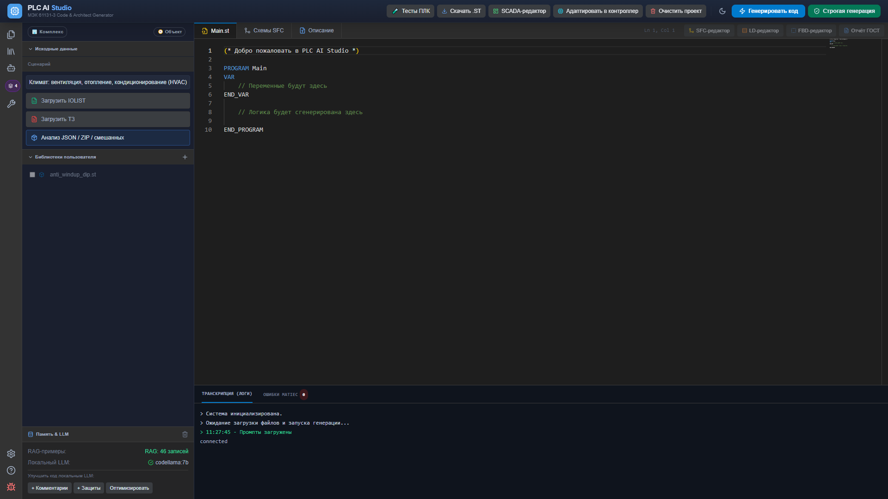
*Рис. 1. Главное окно PLC AI Studio после запуска.*

---

## Содержание

1. [Что это и для кого](#1-что-это-и-для-кого)
2. [Словарь терминов для быстрого старта](#2-словарь-терминов-для-быстрого-старта)
3. [Как устроена программа](#3-как-устроена-программа)
4. [Главная идея: почему код получается рабочим](#4-главная-идея-почему-код-получается-рабочим)
5. [Полный процесс генерации кода — пошагово](#5-полный-процесс-генерации-кода--пошагово)
6. [Режимы работы](#6-режимы-работы)
7. [Две цели проверки: matiec и CODESYS](#7-две-цели-проверки-matiec-и-codesys)
8. [Движки искусственного интеллекта и агенты](#8-движки-искусственного-интеллекта-и-агенты)
9. [Библиотека эталонов: на чём «заземляется» генерация](#9-библиотека-эталонов-на-чём-заземляется-генерация)
10. [Визуальные редакторы](#10-визуальные-редакторы)
11. [Экспорт результатов](#11-экспорт-результатов)
12. [Дополнительные проверки качества кода](#12-дополнительные-проверки-качества-кода)
13. [Проверка безопасности и трассируемость требований](#13-проверка-безопасности-и-трассируемость-требований)
14. [Структура папок программы — что можно менять и добавлять](#14-структура-папок-программы--что-можно-менять-и-добавлять)
15. [Частые вопросы](#15-частые-вопросы)
16. [Полный глоссарий](#16-полный-глоссарий)

---

## 1. Что это и для кого

PLC AI Studio — это рабочий инструмент инженера АСУ ТП. Он берёт на себя самую трудоёмкую часть пусконаладки и проектирования — написание прикладной программы контроллера по техническому заданию — и доводит результат до **компилируемого, проверенного кода**, а не до «черновика из чата».

Программа предназначена для:

- инженеров-программистов ПЛК, которым нужно быстро получить корректный каркас программы по большому перечню сигналов;
- проектировщиков АСУ ТП, которым важны схемы (SFC/LD/FBD), мнемосхема и пояснительная записка;
- наладчиков, которым нужен понятный, проверяемый и переносимый код.

Программа работает **локально на вашем компьютере** (Windows). Облако нужно только если вы пользуетесь облачными моделями (DeepSeek, OpenAI и т. п.); при использовании локальной модели (Ollama) интернет не требуется вовсе. Ключи доступа к моделям хранятся только у вас.

**Важно понимать ограничение ответственности.** Сгенерированный код — это качественный черновик, требующий проверки и сертификации инженером. Финальное решение и ответственность всегда остаются за специалистом.

---

## 2. Словарь терминов для быстрого старта

Чтобы остальной документ читался без вопросов, вот короткие определения. Полный глоссарий — в разделе 15.

| Термин                            | Простое объяснение                                                                                                                                                                                |
| --------------------------------------- | ------------------------------------------------------------------------------------------------------------------------------------------------------------------------------------------------------------------ |
| **ТЗ**                          | Техническое задание — текст с описанием, как должна работать установка.                                                                                |
| **IOLIST**                        | Перечень сигналов: какие входы/выходы есть, их имена, типы, адреса, описание. Обычно таблица Excel/CSV.                                  |
| **Тег**                        | Один сигнал из IOLIST (например,`CNV01_RUN_CMD` — команда пуска конвейера 1).                                                                                          |
| **ST (Structured Text)**          | Текстовый язык программирования ПЛК по стандарту МЭК 61131-3 (похож на Паскаль).                                                                       |
| **POU**                           | «Программный модуль» — единица программы:`PROGRAM`, `FUNCTION_BLOCK` или `FUNCTION`.                                                                                  |
| **ФБ (FUNCTION_BLOCK)**         | Функциональный блок — переиспользуемый модуль логики (например, «мотор», «клапан»), у которого есть входы и выходы. |
| **SFC / LD / FBD**                | Графические языки МЭК: диаграмма последовательности / релейно-контактная схема / схема функциональных блоков.         |
| **SCADA-мнемосхема**    | Технологическая схема установки с отображением состояния оборудования и приборов.                                                          |
| **matiec**                        | Бесплатный компилятор стандартного МЭК 61131-3 (проверяет код «по букве стандарта»).                                                              |
| **CODESYS**                       | Популярная среда программирования ПЛК со своими расширениями языка.                                                                                     |
| **Эталон (RAG)**            | Заранее проверенный образец кода, который программа показывает модели как пример «как надо».                                        |
| **Гейт компиляции** | Автоматический цикл «проверил → исправил → снова проверил», доводящий код до состояния без ошибок.                              |

---

## 3. Как устроена программа

Снаружи это обычное приложение с окном (открывается локально в браузере/окне). Внутри — несколько слоёв, каждый отвечает за свою задачу.

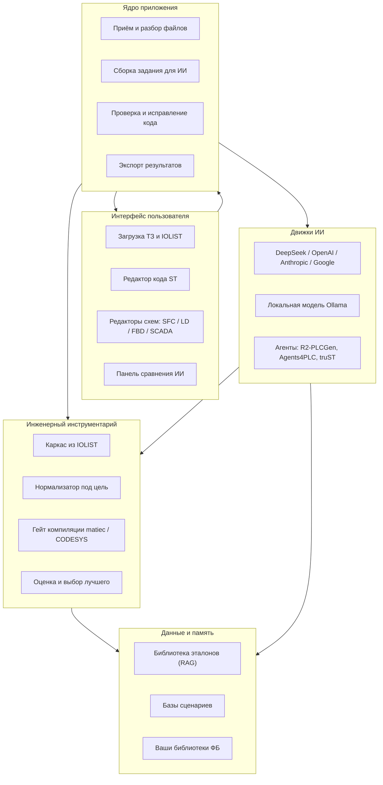
```mermaid
flowchart TB
    subgraph UI["Интерфейс пользователя"]
        U1["Загрузка ТЗ и IOLIST"]
        U2["Редактор кода ST"]
        U3["Редакторы схем: SFC / LD / FBD / SCADA"]
        U4["Панель сравнения ИИ"]
    end

    subgraph CORE["Ядро приложения"]
        R1["Приём и разбор файлов"]
        R2["Сборка задания для ИИ"]
        R3["Проверка и исправление кода"]
        R4["Экспорт результатов"]
    end

    subgraph AI["Движки ИИ"]
        A1["DeepSeek / OpenAI / Anthropic / Google"]
        A2["Локальная модель Ollama"]
        A3["Агенты: R2-PLCGen, Agents4PLC, truST"]
    end

    subgraph TOOLS["Инженерный инструментарий"]
        T1["Каркас из IOLIST"]
        T2["Нормализатор под цель"]
        T3["Гейт компиляции matiec / CODESYS"]
        T4["Оценка и выбор лучшего"]
    end

    subgraph DATA["Данные и память"]
        D1["Библиотека эталонов (RAG)"]
        D2["Базы сценариев"]
        D3["Ваши библиотеки ФБ"]
    end

    UI --> CORE
    CORE --> AI
    CORE --> TOOLS
    AI --> TOOLS
    TOOLS --> DATA
    AI --> DATA
    CORE --> UI
```

*Схема 1. Общее устройство программы. Интерфейс обращается к ядру; ядро использует движки ИИ и инженерный инструментарий; всё опирается на данные и память.*

Коротко о слоях:

- **Интерфейс** — то, что вы видите: загрузка файлов, редактор кода, редакторы схем, сравнение результатов разных ИИ.
- **Ядро** — принимает файлы, готовит задание для ИИ, организует проверку и исправление, делает экспорт.
- **Движки ИИ** — собственно «авторы» прикладной логики: обычные модели (быстро) и агенты (умнее, но дольше).
- **Инженерный инструментарий** — то, что делает результат **инженерным, а не «как получилось у чата»**: каркас из IOLIST, нормализатор, гейт компиляции, оценка.
- **Данные и память** — проверенные эталоны, базы сценариев, ваши собственные библиотеки блоков.

---

## 4. Главная идея: почему код получается рабочим

Раньше типичный подход был такой: «дай нейросети ТЗ и список из сотен сигналов — пусть напишет всю программу за один раз». На практике это давало неполный охват сигналов, повторно объявленные переменные, недопустимые конструкции и обрывы на середине.

PLC AI Studio устроен иначе. Ключевой принцип:

> **Всё, что можно посчитать механически, считает сама программа, а нейросети оставляют только то, что требует «соображения» — прикладную логику небольших блоков.**

Что это значит на практике:

- **Имена переменных, типы, адреса, экземпляры оборудования и разводку входов/выходов программа строит сама** из IOLIST — детерминированно, без участия ИИ. Это убирает целые классы ошибок «как явление»: не бывает ни пропущенных сигналов, ни дублей, ни «выдуманных» имён.
- **Нейросеть пишет только тело функциональных блоков** — короткую, осмысленную логику («как запускать мотор», «как обработать аварию»). Это маленькая задача, с которой модель справляется надёжно и без обрывов.
- **Результат собирается обратно автоматически**, приводится к нужному диалекту и прогоняется через цикл компиляции до состояния «без ошибок».

Именно поэтому код получается полным, корректным по структуре и проверяемым.

---

## 5. Полный процесс генерации кода — пошагово

Ниже — весь путь от ваших файлов до готового результата. Эта же логика работает во всех режимах (см. раздел 6).

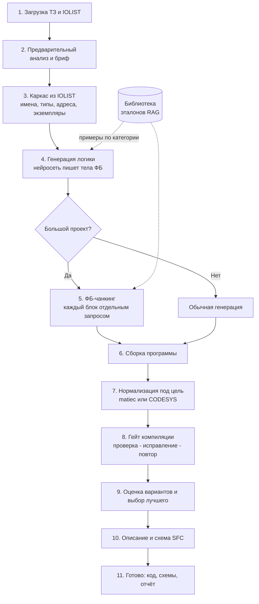
```mermaid
flowchart TD
    S1["1. Загрузка ТЗ и IOLIST"] --> S2["2. Предварительный анализ и бриф"]
    S2 --> S3["3. Каркас из IOLIST<br/>имена, типы, адреса, экземпляры"]
    S3 --> S4["4. Генерация логики<br/>нейросеть пишет тела ФБ"]
    S4 --> S5{"Большой проект?"}
    S5 -->|"Да"| S6["5. ФБ-чанкинг<br/>каждый блок отдельным запросом"]
    S5 -->|"Нет"| S7["Обычная генерация"]
    S6 --> S8["6. Сборка программы"]
    S7 --> S8
    S8 --> S9["7. Нормализация под цель<br/>matiec или CODESYS"]
    S9 --> S10["8. Гейт компиляции<br/>проверка - исправление - повтор"]
    S10 --> S11["9. Оценка вариантов и выбор лучшего"]
    S11 --> S12["10. Описание и схема SFC"]
    S12 --> S13["11. Готово: код, схемы, отчёт"]
    D[("Библиотека<br/>эталонов RAG")] -.->|"примеры по категории"| S4
    D -.-> S6
```

*Схема 2. Полный конвейер генерации. Ромб — точка автоматического выбора пути в зависимости от размера проекта.*

### 5.1. Загрузка ТЗ и IOLIST

Вы загружаете перечень сигналов (Excel/CSV/JSON) и техническое задание (PDF/DOCX/TXT и др.). Можно загрузить и целый ZIP-архив проекта. Программа сама находит строку заголовков в таблице и распознаёт колонки (имя, тип, направление, описание).

*Рис. 2. Загрузка IOLIST и ТЗ. Под таблицей отображается число распознанных строк.*

### 5.2. Предварительный анализ и бриф (Реализовано в блоке - объект)

Перед генерацией программа разбирает сигналы и извлекает из ТЗ числовые уставки и алгоритм. Формируется **технический бриф**: перечень функциональных блоков, режимы работы, блокировки, признаки нормально открытых/закрытых контактов (NC/NO). Бриф показывается вам для подтверждения — вы видите, как программа «поняла» задачу, до того как тратить время на генерацию.

*Рис. 3. Технический бриф: что программа намерена реализовать. Здесь можно скорректировать понимание до генерации.*

### 5.3. Каркас из IOLIST

Это «фундамент», который программа строит **сама, без ИИ**:

- **Канонические имена** — корректные идентификаторы по стандарту с префиксом по типу (`x` — логический, `i` — целый, `r` — вещественный, `w` — слово). Имена с точками и спецсимволами очищаются. Совпадения проверяются без учёта регистра (как в стандарте), поэтому коллизий имён не возникает.
- **Адреса по типу** — логические сигналы получают `%IX/%QX`, целые/слова — `%IW/%QW`, вещественные — `%ID/%QD`; входы и выходы определяются по направлению.
- **Распознавание оборудования** — по префиксу тега (`CNV01_…`, `ST02_…`) сигналы группируются в экземпляры устройств.
- **Один функциональный блок на тип устройства** — все одинаковые по набору сигналов устройства получают общий ФБ, а разные — разные. Например, станки и моечная станция одной линии автоматически попадают в разные блоки.
- **Создание экземпляров и разводка** — для каждого устройства объявляется экземпляр блока и автоматически подключаются его входы и выходы к нужным сигналам.

Главный эффект: **100% охват сигналов гарантирован** независимо от поведения нейросети.

### 5.4. Генерация логики (нейросеть пишет тела блоков)

Программа отдаёт модели готовый каркас и просит заполнить **только логику тел блоков** — что именно делает «мотор», «клапан», «горелка». Объявления и разводку модель не трогает. В задание подмешиваются проверенные **эталоны по категории** (раздел 9) — модель видит образцы «как надо».

### 5.5. ФБ-чанкинг для больших проектов

Если проект большой (много сигналов, несколько типов блоков), программа не пытается получить всё одним огромным ответом — это и приводило к обрывам. Вместо этого включается **ФБ-чанкинг**: тело **каждого** блока запрашивается отдельным коротким запросом.

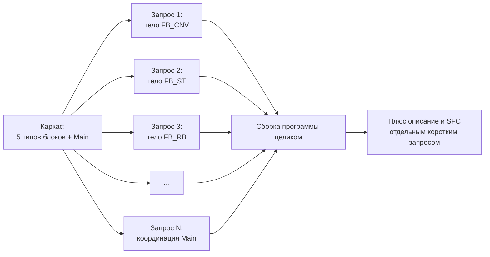
```mermaid
flowchart LR
    A["Каркас:<br/>5 типов блоков + Main"] --> B1["Запрос 1:<br/>тело FB_CNV"]
    A --> B2["Запрос 2:<br/>тело FB_ST"]
    A --> B3["Запрос 3:<br/>тело FB_RB"]
    A --> B4["…"]
    A --> B5["Запрос N:<br/>координация Main"]
    B1 --> C["Сборка программы целиком"]
    B2 --> C
    B3 --> C
    B4 --> C
    B5 --> C
    C --> E["Плюс описание и SFC<br/>отдельным коротким запросом"]
```

*Схема 3. ФБ-чанкинг: вместо одного гигантского (и обрывающегося) ответа — несколько коротких, которые гарантированно укладываются в лимит, а затем собираются в одну программу.*

Так результат для крупных проектов получается **полным**, без обрезанного кода. Этот режим работает со всеми обычными моделями (DeepSeek, OpenAI, Anthropic, Google, Ollama).

### 5.6. Сборка программы

Полученные тела блоков программа вставляет в заранее построенный каркас. Сборка детерминированная: одни и те же исходные данные всегда дают один и тот же корректный каркас. Если модель по какой-то причине вернула не тела, а целую программу — срабатывает безопасный запасной путь, и хуже не становится.

### 5.7. Нормализация под цель

Готовый код приводится к выбранному диалекту:

- для **matiec** — к полностью переносимому стандартному виду (корректные преобразования типов, замена расширений на стандартные конструкции);
- для **CODESYS** — бережно, с сохранением удобных расширений CODESYS.

  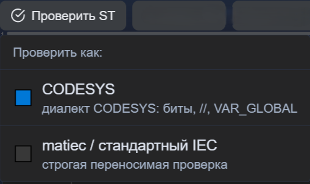

Подробнее о двух целях — раздел 7.

### 5.8. Гейт компиляции

Вместо «проверили один раз и надеемся» работает **замкнутый цикл**:

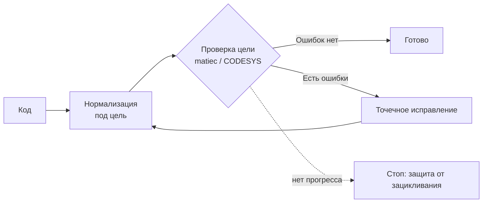
```mermaid
flowchart LR
    A["Код"] --> B["Нормализация<br/>под цель"]
    B --> C{"Проверка цели<br/>matiec / CODESYS"}
    C -->|"Ошибок нет"| OK["Готово"]
    C -->|"Есть ошибки"| F["Точечное исправление"]
    F --> B
    C -.->|"нет прогресса"| STOP["Стоп: защита от зацикливания"]
```

*Схема 4. Гейт компиляции: цикл «нормализовать → проверить → исправить» повторяется до состояния без ошибок, со страховкой от бесконечного цикла.*

### 5.9. Оценка вариантов и выбор лучшего (В режиме Строгая генерация)

Если генерация шла в нескольких ИИ сразу, каждый вариант **оценивается автоматически** (компилируется ли, насколько полно покрыты сигналы, насколько код модульный). Программа сама подсказывает лучший вариант значком, а не заставляет вас вручную сравнивать «сломанные» результаты.

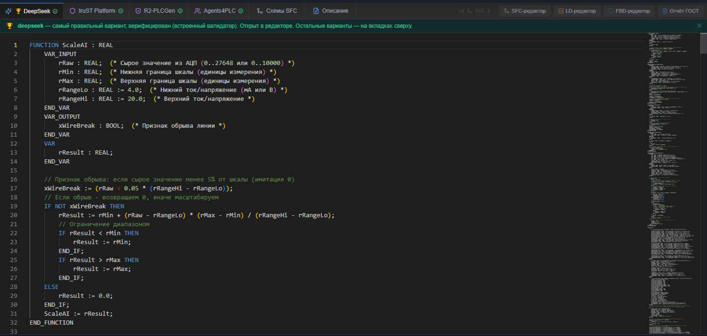
*Рис. 4. Вкладки разных ИИ с оценками; значком отмечен лучший вариант.*

### 5.10. Описание и схема SFC

К коду формируются **текстовое описание на русском** (назначение, режимы, блокировки, аварии) и **диаграмма SFC** основного цикла. Они отображаются рядом с кодом и используются в пояснительной записке.

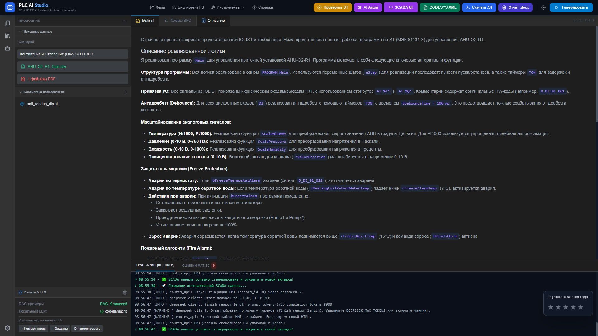

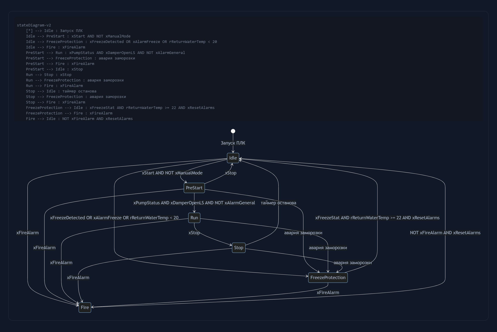
*Рис. 5. Текстовое описание программы и схема последовательности SFC.*

### 5.11. Заземление на эталоны (RAG)

На протяжении генерации модель опирается на **библиотеку проверенных эталонов** по вашей категории (раздел 9). Это резко повышает качество: модель пишет в стиле заведомо корректных образцов, а не «с чистого листа».

---

## 6. Режимы работы

Все три режима ведут к одному и тому же качественному конвейеру (раздел 5). Отличается только то, **как вы подаёте задачу**.

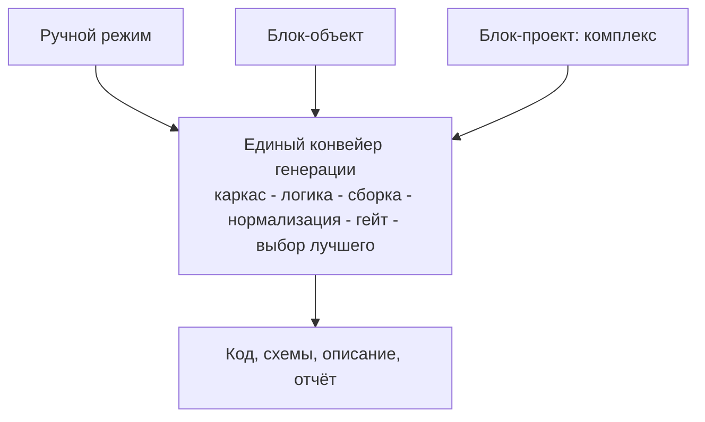
```mermaid
flowchart TB
    M1["Ручной режим"] --> CORE["Единый конвейер генерации<br/>каркас - логика - сборка - нормализация - гейт - выбор лучшего"]
    M2["Блок-объект"] --> CORE
    M3["Блок-проект: комплекс"] --> CORE
    CORE --> OUT["Код, схемы, описание, отчёт"]
```

*Схема 5. Любой режим использует одно и то же проверенное ядро генерации.*

### 6.1. Ручной режим

Основной рабочий режим: вы выбираете категорию (тип установки), загружаете ТЗ и IOLIST и запускаете генерацию. Можно запустить **несколько ИИ параллельно** и сравнить, либо использовать режим повышенной надёжности с пошаговой проверкой по каждому блоку.

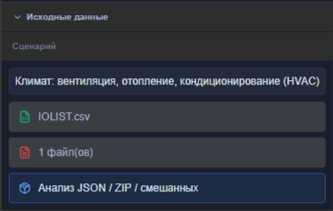
*Рис. 6. Ручной режим: выбор сценария, загрузка ТЗ и IOLIST.*

### 6.2. Блок-объект

Режим для **одного объекта**, оформленного как структурированная система. Удобно, когда нужен один аккуратный объект (например, одна насосная станция) с его сигналами и логикой.

*Рис. 7. Режим «Блок-объект»: мастер одиночного объекта.*

### 6.3. Блок-проект (комплекс)

Режим для **комплекса из нескольких систем**, связанных между собой (например, котельная + водоподготовка + пожарная сигнализация с общими сигналами вроде «Пожар», «Тепло готово»).

```mermaid
flowchart LR
    A["Загрузка ZIP<br/>несколько систем"] --> B["Разбор подсистем<br/>и их типов"]
    B --> C["Определение порядка<br/>и межсистемных сигналов"]
    C --> D["Генерация каждой системы<br/>тем же конвейером"]
    D --> E["Совместная проверка<br/>сценарий взаимодействия"]
    E --> F["Итоговый архив:<br/>код и пояснительная записка"]
```

*Схема 6. Этапы режима «Блок-проект». Каждая система проходит тот же конвейер, что и одиночный объект.*

*Рис. 8. Режим «Блок-проект»: комплекс из нескольких систем и порядок их генерации.*

---

## 7. Две цели проверки: matiec и CODESYS

Один и тот же код можно проверять и приводить под **две независимые цели**. Это важно, потому что «правильность» зависит от того, где код будет работать.

| Цель          | Что это                                                                                                                                                         | Когда выбирать                                                                                                                          |
| ----------------- | --------------------------------------------------------------------------------------------------------------------------------------------------------------------- | ---------------------------------------------------------------------------------------------------------------------------------------------------- |
| **matiec**  | Бесплатный компилятор «по букве стандарта» МЭК 61131-3. Самый строгий эталон переносимости.   | Когда нужен максимально переносимый, стандартный код, либо для строгой проверки. |
| **CODESYS** | Среда со своими удобными расширениями (битовый доступ, комментарии `//`, незанятые выходы). | Когда целевой контроллер программируется в CODESYS и расширения допустимы.                 |

Принципы, которые стоит знать:

* Код, чистый для **matiec**, будет корректен и в **CODESYS** (стандарт — подмножество).
* Кнопка проверки позволяет выбрать цель; кнопка исправления приводит код под выбранную цель.

* По умолчанию результат остаётся в стиле CODESYS; вариант для matiec получается по запросу (проверить под matiec → исправить)

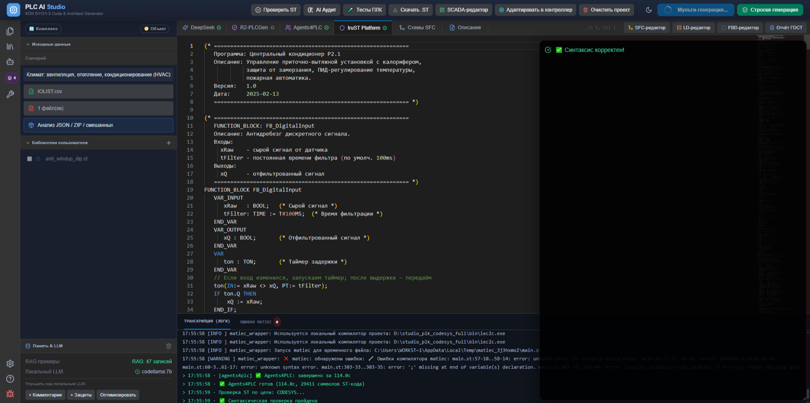

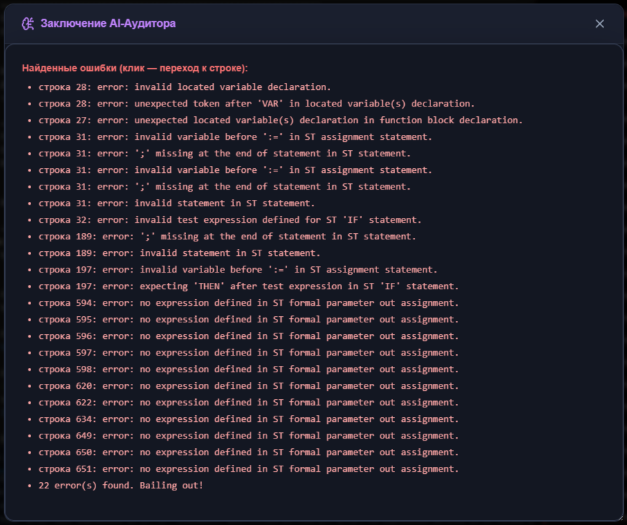

*Рис. 9. Выбор цели проверки и результат: ноль ошибок либо список замечаний компилятора.*

> **Про matiec на вашем компьютере.** Если рядом с программой лежит компилятор `iec2c` (в папке `bin/`), проверка использует **настоящую компиляцию**. Если его нет — этап нативной компиляции пропускается, остаётся встроенная проверка; программа при этом продолжает работать.

---

## 8. Движки искусственного интеллекта и агенты

В программе доступны **обычные модели** (быстрые, пишут логику) и **агенты** (умные многошаговые пайплайны, которые ещё и проверяют/исправляют сами себя).

### 8.1. Обычные модели

| Провайдер           | Особенность                                                                                             | Сеть        |
| ---------------------------- | ------------------------------------------------------------------------------------------------------------------ | --------------- |
| **DeepSeek**           | Лучшее соотношение цена/качество. Рекомендуется по умолчанию. | Облако    |
| **OpenAI (GPT)**       | Сильная общая логика.                                                                            | Облако    |
| **Anthropic (Claude)** | Аккуратная обработка сложных требований.                                       | Облако    |
| **Google (Gemini)**    | Гибкий, удобен для разметки.                                                                | Облако    |
| **Ollama**             | Локальная модель,**полностью офлайн**.                                         | Без сети |

Ключи доступа вводятся в настройках и хранятся только у вас на компьютере.

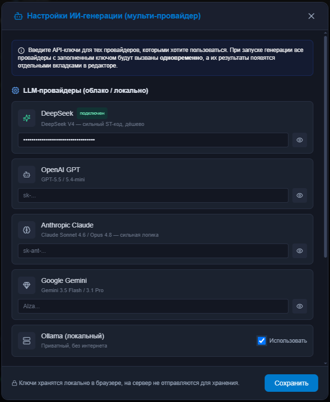
*Рис. 10. Окно настроек: ввод ключей провайдеров и выбор локальной модели.*

> **Почему вместо «Ollama» показывается, например, `qwen2.5-coder:7b`.** Ollama — это не модель, а «движок», который запускает ту модель, которая **установлена у вас локально**. Программа сама подбирает установленную модель и показывает её настоящее имя. Это нормально. Чтобы использовать другую модель, установите её средствами Ollama — она и подхватится.

### 8.2. Агенты

Агенты — это не одна нейросеть, а **связка шагов**, дающая более высокое качество ценой большего времени.

| Агент           | Как работает                                                                                                                                                                | В чём ценность                                                           |
| -------------------- | -------------------------------------------------------------------------------------------------------------------------------------------------------------------------------------- | ------------------------------------------------------------------------------------ |
| **R2-PLCGen**  | Планирует архитектуру → генерирует → проверяет компилятором → исправляет по найденным замечаниям. | Целостный план и самопроверка всей программы. |
| **Agents4PLC** | Подбирает похожие проверенные образцы → генерирует по ним → проверяет условия корректности.             | Опора на эталоны и проверка постусловий.           |
| **truST**      | Генерирует в строгом стиле (единый стандарт оформления, обработка фронтов, явный сброс выходов).       | Строгая, единообразная культура кода.                |

> 
>
> **Совет по большим проектам.** Обычные модели на больших перечнях используют ФБ-чанкинг (раздел 5.5) и выдают полный код. Агенты пишут программу целиком за раз — для очень больших IOLIST им автоматически поднимается лимит ответа; при необходимости его можно ограничить настройкой (см. FAQ).

---

## 9. Библиотека эталонов: на чём «заземляется» генерация

Чтобы код был не «фантазией модели», а в стиле проверенных решений, в программу встроена **библиотека эталонов** — небольшие, заведомо корректные образцы по каждой категории. Перед генерацией модель видит несколько релевантных образцов как пример.

Эталоны делятся на **общие строительные блоки** (применимы во многих сценариях) и **профильные** (специфичны для конкретной отрасли). Сейчас их **19** на **9 категорий**.

### 9.1. Общие строительные блоки

| Блок           | Назначение                                                                                                    |
| ------------------ | ----------------------------------------------------------------------------------------------------------------------- |
| `FB_Motor`       | Пуск/стоп мотора с подтверждением работы и аварией.                          |
| `FB_Conveyor`    | Конвейер с обнаружением затора.                                                              |
| `FB_Debounce`    | Подавление дребезга дискретного входа.                                                |
| `FB_Scale`       | Линейное шкалирование аналогового сигнала в инженерные единицы. |
| `FB_PID`         | ПИД-регулятор с защитой от «раскрутки» интеграла.                             |
| `FB_Estop`       | Цепь аварийного останова с фиксацией и сбросом.                                 |
| `FB_Valve`       | Клапан с контролем времени хода.                                                             |
| `FB_PumpLeadLag` | Два насоса: ведущий/ведомый.                                                                     |
| `FB_FireZone`    | Пожарная зона с фиксацией тревоги.                                                         |
| `FB_Heartbeat`   | Импульс «живучести» для диагностики.                                                    |

### 9.2. Профильные эталоны (по одному на категорию)

| Категория                        | Профильный эталон | Что демонстрирует                                                                                        |
| ----------------------------------------- | --------------------------------- | ------------------------------------------------------------------------------------------------------------------------ |
| BMS / Вентиляция                | `FB_AHU`                        | Вентустановка: вентилятор + клапаны тепла/холода по уставке.           |
| Конвейерные линии         | `FB_BeltZone`                   | Аккумулирующая зона с фотодатчиком и готовностью следующей зоны. |
| Водоподготовка              | `FB_Backwash`                   | Шаговая обратная промывка фильтра.                                                         |
| Энергетика                      | `FB_FeederProtect`              | Максимальная токовая защита с выдержкой времени.                               |
| HMI / SCADA                               | `FB_AlarmManager`               | Агрегация аварий с квитированием и фиксацией.                                     |
| Безопасность (Safety)         | `FB_TwoHand`                    | Двуручное управление с контролем синхронности.                                  |
| Управление движением   | `FB_AxisHoming`                 | Поиск нуля по датчику.                                                                                 |
| Котельные                        | `FB_BurnerSeq`                  | Розжиг: продувка → розжиг с контролем пламени → работа.                     |
| Пожарная сигнализация | `FB_ZoneVote`                   | Голосование «2 из 3» против ложных срабатываний.                                  |

Все эталоны заранее проверены обеими целями (matiec и CODESYS) — ошибок ноль.

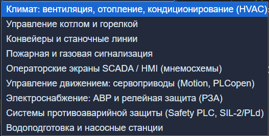
*Рис. 11. Раздел памяти и библиотеки эталонов.*

> **«Откуда в памяти десятки записей, если я столько не делал?»** Это и есть встроенные эталоны: 9 категорий × 5 образцов = 45 проверенных примеров, плюс ваши собственные удачные генерации. Они нужны для качества и ничего не «засоряют». Память можно очистить — тогда эталоны загрузятся заново при следующем запуске.

---

## 10. Визуальные редакторы

Программа не только пишет код, но и строит по нему **графические схемы** — их можно просматривать и редактировать, а затем выгружать.

### 10.1. SFC — диаграмма последовательности

Шаги, переходы с условиями, действия с квалификаторами, параллельные и альтернативные ветви. Подходит для описания циклов и пошаговых процессов.

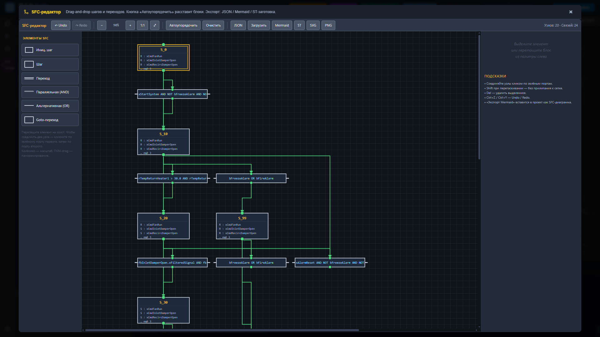
*Рис. 12. Редактор SFC.*

### 10.2. LD — релейно-контактные схемы

Контакты (нормально открытые/закрытые), фронты, катушки (обычная/инверсная/с фиксацией), таймеры и счётчики. Привычный язык для релейной логики.

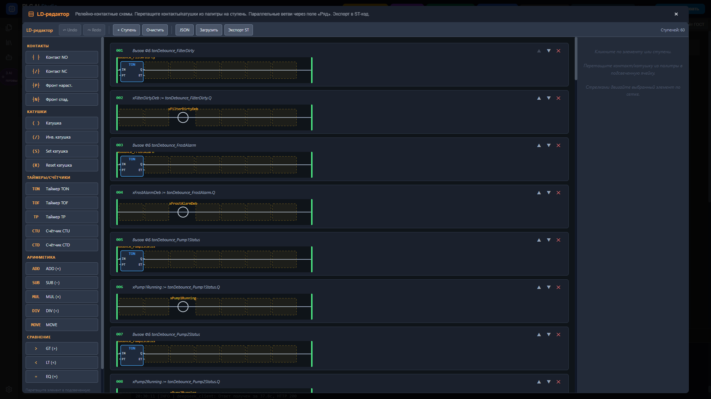
*Рис. 13. Редактор LD.*

### 10.3. FBD — схема функциональных блоков

Логические элементы, триггеры, таймеры, счётчики, арифметика и сравнения, соединённые линиями. Автоматическая раскладка в стиле CODESYS.

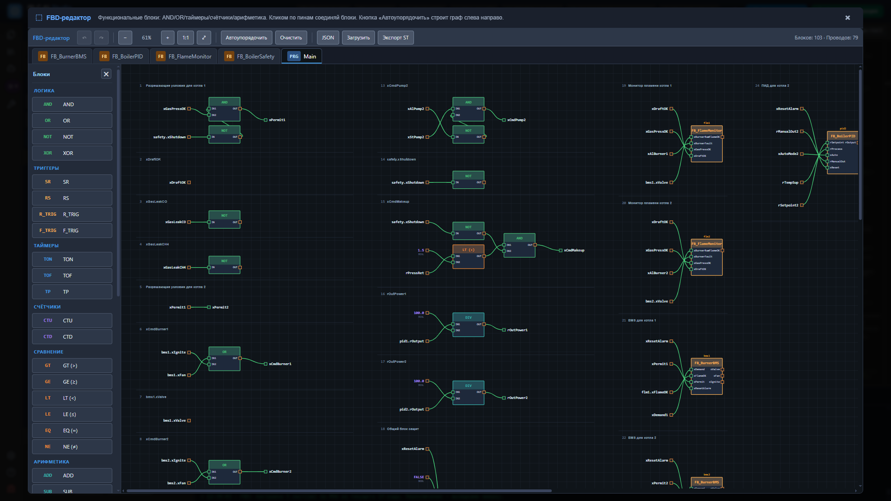
*Рис. 14. Редактор FBD.*

### 10.4. SCADA — технологическая мнемосхема

Программа извлекает структуру установки и **строит мнемосхему**: оборудование, приборы (КИП) на выносках, аварии отдельной группой, режим анимации значений. Схему можно выгрузить как автономный HTML-файл.

*Рис. 15. Технологическая мнемосхема SCADA.*

---

## 11. Экспорт результатов

Готовый проект выгружается в форматы, нужные для дальнейшей работы.

| Формат                | Для чего                                                       |
| --------------------------- | --------------------------------------------------------------------- |
| **PLCopen XML**       | Импорт в CODESYS, TwinCAT, MasterSCADA.                        |
| **`.ST`**           | Чистый текст программы Structured Text.           |
| **DOCX (ГОСТ)**   | Пояснительная записка по ГОСТ 21.408-2013.  |
| **SCADA HTML**        | Автономная интерактивная мнемосхема. |
| **SCL**               | Для Siemens TIA Portal.                                            |
| **`.exp`**          | Проект CODESYS.                                                 |
| **Карта Modbus** | Регистры и сопутствующий код.                |

Поддерживаемые контроллеры: Siemens S7, CODESYS, ОВЕН, WAGO, Segnetics, ТЕКОН, Modbus TCP.

*Рис. 16. Меню экспорта результатов.*

---

## 12. Дополнительные проверки качества кода

Помимо компиляции, встроен **семантический анализатор** — он ловит то, что формально компилируется, но опасно на реальном объекте.

| Проверка                                             | Что находит                                                    | Важность |
| ------------------------------------------------------------ | ------------------------------------------------------------------------ | ---------------- |
| Бесконечный цикл без выхода          | Зависание контроллера                                | Критично |
| Повторное объявление переменной | Двойное объявление (без учёта регистра) | Важно       |
| Конфликт адресов                              | Два сигнала на одном адресе                       | Критично |
| Выход без защиты по времени           | Команда без таймера-защиты                        | Важно       |
| Неинициализированный таймер        | Таймер без уставки времени                        | Важно       |
| Кириллица в идентификаторах         | Нарушение стандарта в именах                    | Средне     |
| Деление без защиты                           | Возможное деление на ноль                          | Критично |

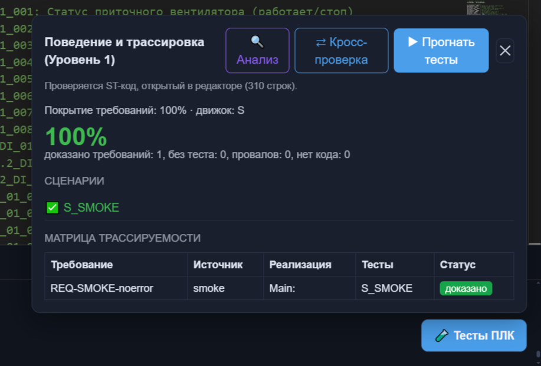

*Рис. 17. Поведение и трассировка.*

---

## 13. Проверка безопасности и трассируемость требований

Компиляция (раздел 5.8) отвечает на вопрос «синтаксис верный?», семантический анализатор (раздел 12) — «нет ли опасных конструкций?». Но ни то, ни другое не проверяет **главное для АСУ ТП**: *делает ли логика то, что требует ТЗ* — сработает ли защита, не запустится ли механизм при аварии. Этот слой закрывает именно этот вопрос: программа **прогоняет сгенерированный код на встроенном соф-ПЛК** по сценариям безопасности и проверяет инварианты — правила, которые обязаны выполняться всегда.

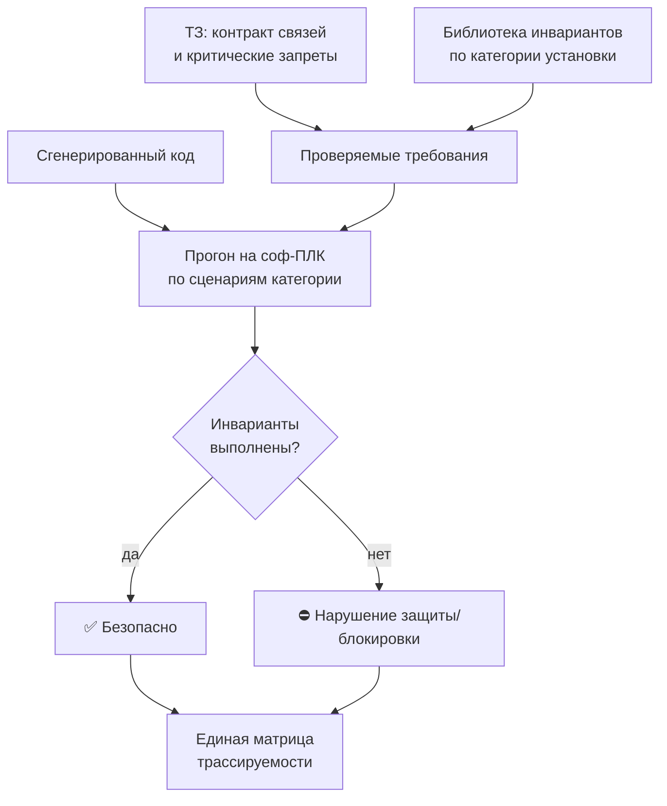
```mermaid
flowchart TB
    GEN["Сгенерированный код"] --> SIM["Прогон на соф-ПЛК<br/>по сценариям категории"]
    TZ["ТЗ: контракт связей<br/>и критические запреты"] --> RULES["Проверяемые требования"]
    CAT["Библиотека инвариантов<br/>по категории установки"] --> RULES
    RULES --> SIM
    SIM --> VERDICT{"Инварианты<br/>выполнены?"}
    VERDICT -->|"да"| OK["✅ Безопасно"]
    VERDICT -->|"нет"| BAD["⛔ Нарушение защиты/блокировки"]
    OK --> MATRIX["Единая матрица<br/>трассируемости"]
    BAD --> MATRIX
```

*Схема 7. Логика проверки безопасности: код исполняется на модельном ПЛК, требования берутся из библиотеки категории и из ТЗ, итог сводится в одну матрицу.*

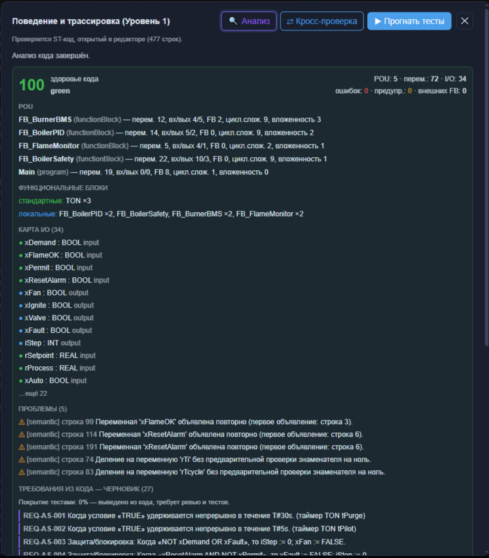

Рис. 18. Выдача результата проверки.

### 13.1. Поведенческая проверка по категории

Для каждой категории установки есть **библиотека инвариантов безопасности** — правил вида «такого быть не должно никогда». Правило написано в *ролях* (например, «E-stop», «команда пуска», «привод»), а программа сама находит эти роли среди ваших сигналов по типу (DI/DO/AI/AO) и описанию и подставляет реальные теги. Если нужной роли в проекте нет — правило просто пропускается, лишнего не штрафует.

Программа подаёт на код «опасную» ситуацию и смотрит на реакцию. Примеры встроенных проверок:

| Категория                              | Что проверяется (инвариант безопасности)                                                                                                 |
| ----------------------------------------------- | --------------------------------------------------------------------------------------------------------------------------------------------------------------------------- |
| Конвейеры                              | Привод не включается и снимается при активном E-stop; снимается по неисправности/перегрузу          |
| Насосные / водоподготовка | Насос не работает при «сухом ходе» (нет воды)                                                                                           |
| Вентиляция (BMS/HVAC)                 | При низкой температуре включается защита от замораживания, заслонка закрывается                       |
| Котлы                                      | При пожаре закрывается газовый/топливный клапан; нагрев отключается при превышении давления |
| Пожарная сигнализация       | Срабатывание извещателя поднимает оповещение                                                                                       |
| Энергетика                            | Выключатель отключается по срабатыванию защиты (РЗА)                                                                           |
| Движение / приводы               | На концевике движение запрещено; E-stop снимает разрешение привода                                                      |

Эти правила — **стартовый набор**, который настраивается под объект (раздел 13.5). Полярность сигналов (например, NC-контакт E-stop, где TRUE = норма) и пороги (давление, температура) вы при необходимости поправляете под конкретный проект.

### 13.2. Влияние на выбор лучшего варианта

Поведенческая проверка встроена в автоматическую оценку вариантов (раздел 5.9). К прежним критериям (компилируемость, охват сигналов, модульность) добавляется **поведение**, причём с жёстким приоритетом безопасности:

- вариант получает прибавку за пройденные проверки;
- **любое нарушение инварианта безопасности резко опускает балл** — небезопасный, но «красиво скомпилированный» код не может победить безопасный с косметическими замечаниями.

В ручном режиме вердикт виден прямо на вкладке каждого ИИ: «✅ безопасно N/N» или «⛔ небезопасно» с указанием нарушенного правила.

### 13.3. Согласие провайдеров (ensemble)

Если генерация шла в нескольких ИИ, программа прогоняет **одни и те же** проверки на коде каждого и сравнивает вердикты. Если все реализовали блокировку одинаково — доверие выше. Если по какому-то правилу **расхождение** (часть моделей прошла, часть нет) — это место отмечается флагом «нужен глаз инженера».

Важно: большинство — не истина. Согласие используется как **подсказка и мягкий ориентир**, оно не отменяет проверку безопасности: одинокая, но правильная модель не штрафуется.

### 13.4. Контракт ТЗ → проверяемые требования

В режиме «Блок-проект» из ТЗ извлекаются дополнительные требования:

- **Межсистемные блокировки.** Контракт связей (раздел 6.3) задаёт, какие сигналы система-потребитель обязана читать (например, «Котёл» читает «Пожар»). Программа проверяет, что каждый такой сигнал **реально используется в коде** потребителя. Если нет — блокировка из ТЗ объявлена, но не реализована; это подсвечивается при сохранении системы.
- **Критические запреты.** Запреты из ТЗ («нельзя запускать насос при сухом ходе», «при пожаре закрыть газовый клапан») сопоставляются с известными паттернами и превращаются в проверяемые инварианты. Что распознано — проверяется автоматически; что **не** распознано — возвращается списком инженеру (программа не выдумывает требований из текста, который не поняла однозначно).

  

### 13.5. Единая матрица трассируемости

Все требования сводятся в **одну таблицу** — чтобы не было параллельных списков. Каждая строка помечена источником и статусом, и связана с кодом:

| Источник строки | Откуда                                                     | Возможный статус                                                         |
| ----------------------------- | ---------------------------------------------------------------- | --------------------------------------------------------------------------------------- |
| ТЗ                          | требования из брифа и IOLIST                   | реализовано / доказано / отсутствует                      |
| safety / проверка     | инварианты безопасности категории | **доказано** (прогон пройден) / **провалено** |
| ТЗ-запрет             | запреты из ТЗ                                         | доказано / провалено                                                   |
| контракт              | межсистемные блокировки                    | реализовано /**отсутствует**                                |

«Доказано» означает не «скомпилировалось», а «проверено исполнением на модельном ПЛК». В режиме «Блок-объект» матрица показывается в панели Уровня 1; клик по строке подсвечивает соответствующие строки кода. В «Блок-проекте» такая матрица формируется по каждой подсистеме.

> Реконструкция требований «из существующего кода» (для анализа чужих, ранее написанных программ — brownfield) остаётся отдельным инструментом и намеренно не смешивается с этой матрицей: это разные по смыслу вещи — *предписанное требование* против *восстановленного по факту*.

### 13.6. Где настраивать

Встроенные инварианты есть во всех категориях. Свои правила под конкретный объект добавляются файлом `behavior_rules/<категория>.json` (формат и примеры — в `behavior_rules/README.md`, см. раздел 14 о структуре папок). Так инженер расширяет проверки, не трогая код программы.

### 13.7. Как это работает в трёх режимах

| Режим            | Что даёт проверка безопасности                                                                                                                                                                                                         |
| --------------------- | ----------------------------------------------------------------------------------------------------------------------------------------------------------------------------------------------------------------------------------------------------------------- |
| Ручной          | Вердикт «безопасно / небезопасно» и ensemble-расхождения на вкладках ИИ; влияет на выбор лучшего                                                                                         |
| Блок-объект | Полная панель: прогон, матрица трассируемости (требования ТЗ + проверки безопасности в одной таблице), подсветка кода                                            |
| Блок-проект | Каждая система генерируется ручным потоком (те же вердикты) + проверка межсистемных блокировок контракта и запретов ТЗ по каждой подсистеме |

---

## 14. Структура папок программы — что можно менять и добавлять

После установки рядом с программой появляются папки. Большинство трогать не нужно, но **некоторые вы можете дополнять сами** — и это штатный способ настройки под свои задачи.

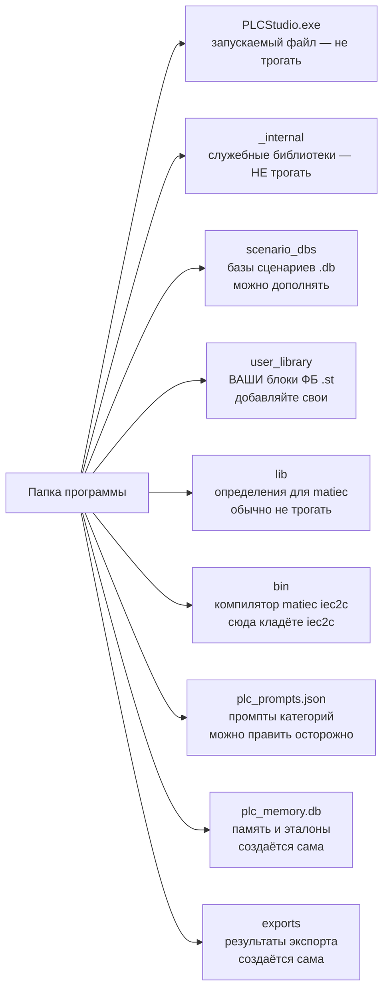
```mermaid
flowchart LR
    ROOT["Папка программы"]
    ROOT --> Exe["PLCStudio.exe<br/>запускаемый файл — не трогать"]
    ROOT --> Internal["_internal<br/>служебные библиотеки — НЕ трогать"]
    ROOT --> Scen["scenario_dbs<br/>базы сценариев .db<br/>можно дополнять"]
    ROOT --> UserLib["user_library<br/>ВАШИ блоки ФБ .st<br/>добавляйте свои"]
    ROOT --> Lib["lib<br/>определения для matiec<br/>обычно не трогать"]
    ROOT --> Bin["bin<br/>компилятор matiec iec2c<br/>сюда кладёте iec2c"]
    ROOT --> Prompts["plc_prompts.json<br/>промпты категорий<br/>можно править осторожно"]
    ROOT --> Mem["plc_memory.db<br/>память и эталоны<br/>создаётся сама"]
    ROOT --> Exp["exports<br/>результаты экспорта<br/>создаётся сама"]
```

*Схема 7. Состав папки программы и что с чем можно делать (зелёным по смыслу — то, что вы дополняете сами: `user_library`, `scenario_dbs`, `bin`).*

Подробно по каждому пункту:

| Папка/файл        | Что внутри                                                                                                                                    | Можно ли менять                                                                                                                                                                                                                                            |
| ------------------------------ | ------------------------------------------------------------------------------------------------------------------------------------------------------ | ----------------------------------------------------------------------------------------------------------------------------------------------------------------------------------------------------------------------------------------------------------------------- |
| **`PLCStudio.exe`**    | Сам запускаемый файл программы.                                                                                             | Нет.                                                                                                                                                                                                                                                                 |
| **`_internal/`**       | Встроенный Python и библиотеки (создаёт упаковщик).                                                               | **Нет, не трогать** — иначе программа не запустится.                                                                                                                                                                       |
| **`scenario_dbs/`**    | Базы данных сценариев (`*.db`) по категориям. Вынесены наружу специально.                     | **Да** — можно обновлять и дополнять базами без переустановки программы.                                                                                                                                |
| **`user_library/`**    | Ваши собственные проверенные функциональные блоки (`.st`) и вспомогательные файлы. | **Да** — это главный способ «научить» программу вашим блокам: положите сюда `.st`, и ИИ будет вызывать именно их.                                                           |
| **`lib/`**             | Стандартные определения МЭК для компилятора matiec.                                                             | Обычно нет; меняйте, только если понимаете зачем.                                                                                                                                                                               |
| **`bin/`**             | Сюда помещается компилятор `iec2c` (matiec).                                                                                 | **Да** — положив сюда `iec2c`, вы включаете настоящую компиляцию для проверки.                                                                                                                           |
| **`plc_prompts.json`** | Текстовые инструкции (промпты) для каждой из 9 категорий.                                                | **Да, осторожно** — можно адаптировать формулировки под свои требования; ошибки в формате могут ухудшить генерацию. Сделайте резервную копию. |
| **`plc_memory.db`**    | Память и библиотека эталонов (RAG).                                                                                           | Создаётся автоматически. Можно удалить, чтобы очистить память — эталоны загрузятся заново при следующем запуске.                                                        |
| **`exports/`**         | Сюда складываются выгруженные результаты.                                                                         | Создаётся автоматически; содержимое — ваше.                                                                                                                                                                                        |

> **Короткий вывод для пользователя:** чаще всего вы будете дополнять `user_library/` (свои блоки) и, при желании, `scenario_dbs/`. Если есть компилятор matiec — кладёте его в `bin/`. Всё остальное можно не трогать.

---

## 15. Частые вопросы

**Нужен ли интернет?**
Для облачных моделей — да. Для локальной модели (Ollama) — нет. Остальные функции работают без сети.

**Какие форматы IOLIST поддерживаются?**
`.xlsx`, `.xls`, `.xlsm`, `.csv`, `.tsv`, `.json`. Строка заголовков находится автоматически.

**Куда уходят мои API-ключи?**
Только в локальное хранилище на вашем компьютере, напрямую к провайдеру. В программе и в логах ключей нет.

**Почему один из ИИ «не вернул код» или код оказался короче?**
Чаще всего это упирание в лимит длины ответа на очень больших проектах. Для обычных моделей включается ФБ-чанкинг (короткие запросы), а для больших перечней автоматически поднимается лимит ответа. Если ваша модель не принимает большой лимит, его можно ограничить настройкой `MAX_OUTPUT_TOKENS_CAP` (например, значением 24000).

**Почему вместо Ollama показана конкретная модель (qwen2.5-coder и т. п.)?**
Это нормально: Ollama запускает установленную у вас локальную модель и показывает её настоящее имя (см. раздел 8.1).

**Откуда в памяти много записей, если я столько проектов не делал?**
Это встроенные проверенные эталоны (раздел 9). Они нужны для качества и не мешают вашим данным.

**Можно ли добавить свои функциональные блоки?**
Да — положите `.st`-файлы в `user_library/` (раздел 14), и программа будет предлагать модели использовать именно их.

**Заменяет ли программа инженера?**
Нет. Результат — качественный черновик, требующий проверки и сертификации. Ответственность остаётся за специалистом.

**В каком стиле выдаётся код по умолчанию — matiec или CODESYS?**
По умолчанию — в стиле CODESYS. Переносимый вариант под matiec получается по запросу через проверку и исправление под эту цель.

---

## 16. Полный глоссарий

- **АСУ ТП** — автоматизированная система управления технологическим процессом.
- **ПЛК** — программируемый логический контроллер.
- **МЭК 61131-3 (IEC 61131-3)** — международный стандарт языков программирования ПЛК.
- **ST (Structured Text)** — текстовый язык программирования ПЛК (паскалеподобный).
- **POU (Program Organization Unit)** — программный модуль: `PROGRAM`, `FUNCTION_BLOCK`, `FUNCTION`.
- **FUNCTION_BLOCK (ФБ)** — переиспользуемый модуль логики со своими входами/выходами и внутренней памятью.
- **IOLIST** — перечень входов/выходов (сигналов) объекта.
- **Тег** — отдельный сигнал в IOLIST.
- **NC/NO** — нормально замкнутый / нормально разомкнутый контакт.
- **Уставка** — заданное значение параметра (порог, время, давление и т. п.).
- **SFC (Sequential Function Chart)** — графический язык диаграмм последовательности.
- **LD (Ladder Diagram)** — релейно-контактные схемы.
- **FBD (Function Block Diagram)** — схема функциональных блоков.
- **SCADA** — система диспетчеризации и отображения технологического процесса (здесь — генерация мнемосхемы).
- **matiec** — открытый компилятор стандартного МЭК 61131-3; `iec2c` — его исполняемый файл.
- **CODESYS** — среда разработки ПЛК со своими расширениями языка.
- **PLCopen XML** — обменный формат проектов между средами разработки ПЛК.
- **Каркас (scaffold)** — детерминированно построенная из IOLIST основа программы (объявления, адреса, экземпляры, разводка).
- **ФБ-чанкинг** — генерация тела каждого функционального блока отдельным запросом с последующей сборкой.
- **Нормализатор** — механическое приведение кода к выбранному диалекту (matiec/CODESYS).
- **Гейт компиляции** — цикл «нормализовать → проверить → исправить» до отсутствия ошибок.
- **Best-of-N** — автоматическая оценка нескольких вариантов и выбор лучшего.
- **RAG / эталоны** — заранее проверенные образцы кода, показываемые модели как примеры для повышения качества.
- **Агент** — многошаговый ИИ-пайплайн (план → генерация → проверка → исправление).

---

*PLC AI Studio — руководство пользователя и научно-техническое описание. Июнь 2026.*
